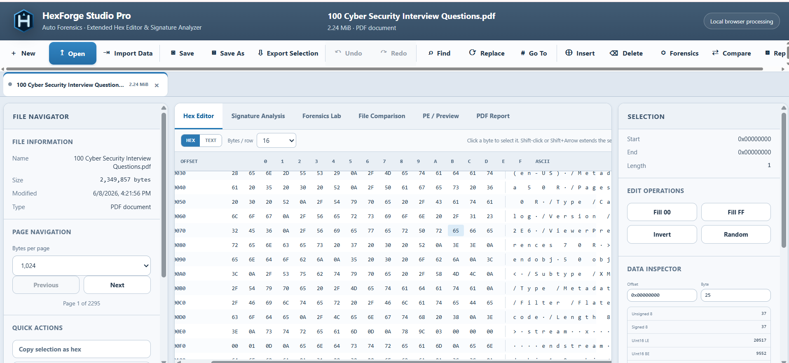
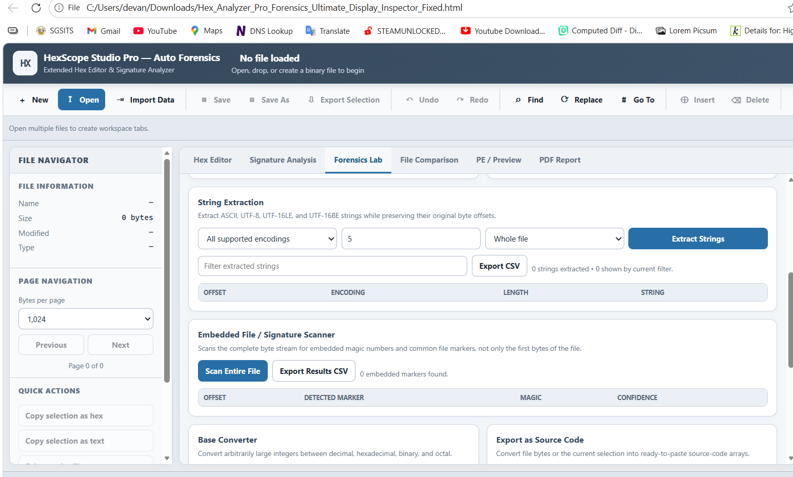
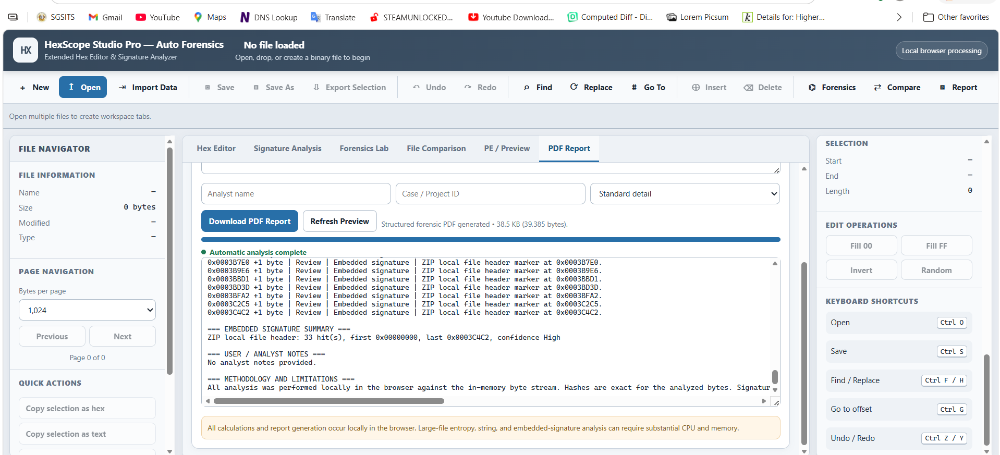
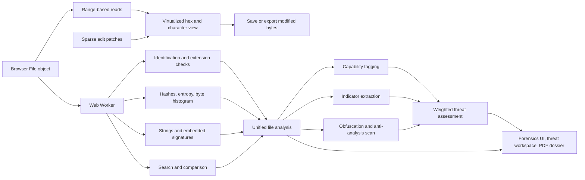

<div align="center">
  

# HexForge Studio Pro

**Local-first browser hex editing and forensic binary analysis.**

[](https://github.com/D3v4nshPat3l/HexForge-Studio-Pro/actions/workflows/ci.yml)
[](https://github.com/D3v4nshPat3l/HexForge-Studio-Pro/actions/workflows/codeql.yml)
[](https://github.com/D3v4nshPat3l/HexForge-Studio-Pro/actions/workflows/deploy-pages.yml)
[](CHANGELOG.md)
[](package.json)
[](https://www.typescriptlang.org/)
[](LICENSE)

[**Launch the application**](https://d3v4nshpat3l.github.io/HexForge-Studio-Pro/) · [Report a bug](https://github.com/D3v4nshPat3l/HexForge-Studio-Pro/issues/new?template=bug_report.yml) · [Request a feature](https://github.com/D3v4nshPat3l/HexForge-Studio-Pro/issues/new?template=feature_request.yml)
</div>

> [!IMPORTANT]
> Files are processed locally in the browser for the core editing and analysis workflow. HexForge Studio Pro does not require a backend to open, inspect, modify, analyze, compare, or export files.



## Overview

HexForge Studio Pro is a browser-based binary workstation for developers, reverse engineers, security researchers, incident responders, and digital-forensics practitioners. It combines a virtualized hex editor with search, file identification, hashing, entropy analysis, string extraction, comparison, executable inspection, a weighted threat-assessment engine, and a paginated PDF forensic dossier.

The editor is designed around range-based file reads and sparse modifications rather than placing an entire file into application state. Analysis, search, and threat scoring run in a Web Worker to keep the interface responsive during heavier workloads.

## Why HexForge Studio Pro?

| Capability | What it provides |
| --- | --- |
| **Local-first operation** | Core processing remains on the analyst's device and does not depend on an application server. |
| **Large-file-oriented editing** | Continuous virtualized scrolling renders visible rows with a small buffer instead of building a full-file DOM view. |
| **Forensic analysis workflow** | Identification, hashes, entropy, strings, embedded signatures, comparison, notes, and PDF reporting are available in one workspace. |
| **Triage-oriented threat scoring** | Capability tagging, indicator extraction, and obfuscation detection roll into one capped, weighted score with per-finding analyst guidance. |
| **Non-destructive editing model** | Sparse patches are overlaid on range reads until the user explicitly saves or exports the modified bytes. |
| **Display-scale aware interface** | A dark forensic console with a light mode, built on fluid scales that gain density on 4K and ultrawide panels. |
| **Portable deployment** | The application can run through Vite locally or as a static GitHub Pages site. |

## Core capabilities

### Hex editing and workspace

- Continuous virtualized full-file hexadecimal and character views
- Pinned offset and character columns with high-visibility scrollbars
- Multiple workspace tabs and drag-and-drop file opening
- New-file creation, save, export, undo, and redo
- Overwrite, insert, delete, fill, invert, and randomize operations
- Byte selections, cursor navigation, and regional operations
- Character rendering modes for Windows-1252, Latin-1, and ASCII
- Bit editor, base converter, and source-code export

### Search and navigation

- Hexadecimal byte-pattern search
- Wildcard byte search
- Text and regular-expression search
- Signed and unsigned integer search
- Floating-point search
- Navigable results and difference ranges
- Stack-safe ASCII, UTF-8, UTF-16LE, and UTF-16BE string extraction

> [!NOTE]
> Regular-expression search is intentionally limited to 64 MiB because character-to-byte offset mapping becomes expensive at larger sizes. Byte and text searches remain the preferred options for large files.

### Automated analysis

- Conservative file-signature identification
- File-extension consistency checks
- Embedded-file signature scanning
- MD5, SHA-1, SHA-256, SHA-512, BLAKE3, and CRC-32 hashes
- Whole-file and selected-region entropy with an adaptive window
- Suspicious high-entropy region detection
- Full-file byte frequency distribution
- PE/COFF structural analysis
- Browser-native image preview for decoder-supported formats
- Binary comparison with navigable difference ranges

### Threat intelligence

- Composite 0–100 threat score with a six-band triage classification
- Weighted findings register with per-category score caps
- Capability tagging across 14 behaviour classes: anti-debugging, sandbox evasion, code injection, privilege escalation, persistence, credential access, keylogging, network staging, cryptography, destructive/ransomware actions, discovery, defence evasion, and interpreter staging
- Indicator-of-compromise extraction: URLs, IPv4/IPv6, domains, emails, registry keys, filesystem paths, Base64 blobs, GUIDs, cryptocurrency wallets, living-off-the-land command lines, and hard-coded user agents
- Single-byte XOR key recovery with decoded-header evidence
- Packer and protector detection (UPX, Themida, VMProtect, ASPack, Enigma, ConfuserEx, PyInstaller, and others)
- Cryptographic constant-table identification (AES, MD5, SHA-1/256/512, CRC-32, Blowfish, ChaCha20/Salsa20, TEA)
- Position-independent code detection: GetPC stubs, PEB walks, direct syscall gates, NOP and INT3 sleds
- Entropy discontinuity mapping and embedded-executable carving targets

> [!IMPORTANT]
> The threat score orders samples for triage. It is not a malware verdict. A capability match proves a string is present, not that the corresponding API is imported, reachable, or ever executed.

### Reporting

- Paginated forensic dossier with a cover page and risk gauge
- Executive summary, severity distribution, and score composition by category
- Auto-generated table of contents with verified page references
- Vector charts: entropy profile, byte histogram, PE section map, category bars
- Findings register with severity pills, contributing weights, and analyst guidance
- Capability and indicator appendices with preserved byte offsets
- Chain-of-custody continuation block and case/acquisition record
- Hexadecimal excerpt from the cursor or current selection
- Optional classification banner stamped on the cover and every page
- Per-page SHA-256 footer, headers, and page numbering
- Three detail levels with explicit counts for omitted rows

### Workspace

- Dark forensic console theme with a light mode, persisted per browser
- Fluid type and spacing scales that gain density on 1440p, 4K, and ultrawide displays

## Forensics lab



## PDF report



## Format compatibility

Every regular file can be opened as bytes and used with the general-purpose hex viewing, editing, searching, hashing, entropy, string extraction, comparison, export, and reporting features.

Specialized identification or structural intelligence is available across a broad range of formats, including:

| Category | Examples |
| --- | --- |
| Images and camera RAW | PNG, JPEG, GIF, BMP, TIFF, ICO, PSD, SVG, JPEG 2000, OpenEXR, CR2, NEF, ARW, DNG, ORF, RW2, RAF, and CR3 |
| Archives and compression | TAR, ZIP and ZIP-derived containers, GZIP, BZIP2, XZ, 7-Zip, RAR, and CAB |
| Disk and virtual-disk images | ISO 9660, DMG, VHD, VHDX, and QCOW2 |
| Audio and video | WAV, FLAC, OGG, AAC, AIFF/AIFC, MIDI, AVI, MKV, WebM, MPEG, FLV, WMV/ASF, and MP3 |
| Executables and firmware | PE/COFF, ELF, Mach-O, Java Class, Android DEX, UEFI firmware volumes, EFI images, U-Boot images, and Linux x86 bzImage |
| Documents and structured data | PDF, PostScript/EPS, EPUB, CHM, DjVu, XML, HTML, JSON, CSV, ODS, ODP, and plain text |
| Encoded firmware records | Intel HEX and Motorola S-record |

See [Supported formats](SUPPORTED_FORMATS.md) for the detailed compatibility statement.

> [!CAUTION]
> Raw-byte compatibility does not imply complete decoding, decompression, filesystem parsing, or rendered preview. Proprietary, encrypted, damaged, vendor-specific, undocumented, or deliberately disguised files may require dedicated tooling.

## Architecture



The main UI thread owns tabs, cursor navigation, virtual rendering, sparse edits, report orchestration, and export state. The worker handles automatic analysis, search, and comparison away from the UI thread. See [Architecture](ARCHITECTURE.md) for implementation details.

## Requirements

- Node.js 20.19 or later; Node.js 22 LTS is recommended
- npm 10 or later
- A current version of Microsoft Edge, Google Chrome, Firefox, or another modern browser

## Quick start

```bash
git clone https://github.com/D3v4nshPat3l/HexForge-Studio-Pro.git
cd HexForge-Studio-Pro
npm ci
npm run dev
```

Open the address printed by Vite, normally `http://localhost:5173`.

### Available commands

| Command | Purpose |
| --- | --- |
| `npm run dev` | Start the Vite development server on all local interfaces |
| `npm run typecheck` | Run TypeScript validation without emitting files |
| `npm test` | Run the Vitest test suite once |
| `npm run build` | Type-check and create the production bundle in `dist/` |
| `npm run preview` | Serve the production build locally for verification |

### Windows workspace example

```bat
cd /d "D:\Hex Forge Studio"
npm ci --no-audit --no-fund
npm run dev
```

See the [Windows installation guide](SETUP_GUIDE_WINDOWS.md) for a fuller setup walkthrough.

## Verification

Run the complete local verification sequence before publishing changes:

```bash
npm run typecheck
npm test
npm run build
```

The production output is written to `dist/`.

## GitHub Pages deployment

The repository includes `.github/workflows/deploy-pages.yml`.

1. Open the repository's **Settings → Pages** page.
2. Select **GitHub Actions** as the deployment source.
3. Push to `main`.
4. The workflow builds and publishes the static application.

Deployment URL:

```text
https://d3v4nshpat3l.github.io/HexForge-Studio-Pro/
```

## Recommended forensic workflow

1. Preserve the original evidence and work from a verified copy.
2. Calculate and record independent cryptographic hashes before analysis.
3. Open the working copy in HexForge Studio Pro and document relevant offsets, signatures, strings, and entropy regions.
4. Record analyst notes and export a PDF report for review.
5. Recalculate hashes for any exported or intentionally modified artifact.
6. Maintain chain-of-custody records outside the application according to your organization's procedures.

## Privacy, security, and evidentiary limitations

HexForge Studio Pro is an analysis aid, not a substitute for validated forensic tooling, malware sandboxing, specialist parsers, or expert review. Signature matches and suspicious-region indicators are evidence-based leads, not proof of file type, provenance, trustworthiness, or malicious behavior.

Browser-native preview depends on the active browser's decoders. Archive listing, decompression, disk-image filesystem parsing, proprietary RAW rendering, and architecture-specific firmware analysis require additional parsers and resource controls. Files designed to trigger decompression bombs, parser edge cases, or excessive resource consumption should be handled in an appropriately isolated environment.

Review the [known limitations](KNOWN_LIMITATIONS.md) and [security policy](SECURITY.md) before using the application in a production investigation.

## Documentation

| Document | Purpose |
| --- | --- |
| [Windows installation](SETUP_GUIDE_WINDOWS.md) | Set up and run the project on Windows |
| [GitHub publishing guide](GITHUB_SETUP_WINDOWS.md) | Publish and deploy the repository from Windows |
| [Architecture](ARCHITECTURE.md) | Understand the UI, worker, analysis, editor, and report design |
| [Integration notes](INTEGRATION.md) | Review component and integration guidance |
| [Supported formats](SUPPORTED_FORMATS.md) | See raw-byte and specialized format compatibility |
| [Known limitations](KNOWN_LIMITATIONS.md) | Understand intentional constraints and unsupported workflows |
| [Contributing](CONTRIBUTING.md) | Prepare changes and submit contributions |
| [Security policy](SECURITY.md) | Report vulnerabilities responsibly |
| [Changelog](CHANGELOG.md) | Review notable changes by release |

## Contributing

Contributions, defect reports, and focused feature proposals are welcome through GitHub. Before submitting a pull request:

```bash
npm ci
npm run typecheck
npm test
npm run build
```

Read [CONTRIBUTING.md](CONTRIBUTING.md) for repository conventions and submission expectations.

For security-sensitive findings, do not open a public issue. Follow the private reporting process described in [SECURITY.md](SECURITY.md).

## License

Copyright © 2026 Devansh Patel. All rights reserved.

This repository is not distributed under an open-source license. See [LICENSE](LICENSE) for the controlling terms.
