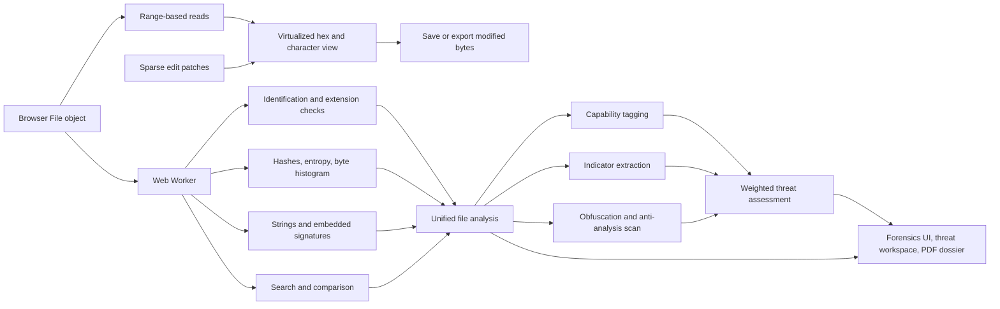

<div align="center">
  

# HexForge Studio Pro

**A local-first binary forensics workstation that runs entirely in your browser.**

Hex editing, file identification, threat scoring, and handover-ready reporting — with no backend, no upload, and no telemetry.

[](https://github.com/D3v4nshPat3l/HexForge-Studio-Pro/actions/workflows/ci.yml)
[](https://github.com/D3v4nshPat3l/HexForge-Studio-Pro/actions/workflows/codeql.yml)
[](https://github.com/D3v4nshPat3l/HexForge-Studio-Pro/actions/workflows/deploy-pages.yml)
[](CHANGELOG.md)
[](package.json)
[](https://www.typescriptlang.org/)
[](LICENSE)

### [**▶ Launch the application**](https://d3v4nshpat3l.github.io/HexForge-Studio-Pro/)

[Report a bug](https://github.com/D3v4nshPat3l/HexForge-Studio-Pro/issues/new?template=bug_report.yml) · [Request a feature](https://github.com/D3v4nshPat3l/HexForge-Studio-Pro/issues/new?template=feature_request.yml) · [Changelog](CHANGELOG.md)

</div>

---


## Why this exists

Most binary analysis workflows start by uploading a sample to somebody else's server. That is a non-starter when the file is evidence, contains customer data, or is suspected malware you are not permitted to redistribute.

HexForge Studio Pro performs the entire workflow client-side. Files are read through `Blob.slice()` range requests and never leave the browser process — there is no upload endpoint to send them to.

<table>
<tr><td width="50%">

**🔒 Local-first by construction**

No server component exists. Range-based reads and sparse patches mean a multi-gigabyte image is never held in memory.

</td><td width="50%">

**⚡ Built for large files**

Virtualized scrolling renders only visible rows. Analysis runs in a Web Worker, so the interface never blocks.

</td></tr>
<tr><td width="50%">

**🎯 Triage-oriented scoring**

Capability tagging, indicator extraction, and obfuscation detection collapse into one capped, explainable score.

</td><td width="50%">

**📄 Reports you can hand over**

A paginated dossier with vector charts, a verified table of contents, and a chain-of-custody block.

</td></tr>
</table>

---

## Feature tour

<details open>
<summary><b>Hex editing and workspace</b></summary>
<br>

- Continuous virtualized hexadecimal and character views across the whole file
- Pinned offset and character columns with high-visibility scrollbars
- Multiple workspace tabs, drag-and-drop opening, and new-file creation
- Overwrite, insert, delete, fill, invert, and randomize operations
- Non-destructive model: sparse patches overlay range reads until you explicitly save
- Full undo and redo, byte selections, and regional operations
- Character rendering for Windows-1252, Latin-1, and ASCII
- Bit editor, base converter (radix 2–36), and source-code export for nine languages

</details>

<details open>
<summary><b>Search and navigation</b></summary>
<br>

| Mode | Notes |
| --- | --- |
| Hex pattern | Supports `??` wildcard bytes |
| Text | UTF-8, UTF-16LE, UTF-16BE; optional case-insensitivity |
| Regular expression | Capped at 64 MiB — see the note below |
| Integer | Signed and unsigned, 1/2/4/8 bytes, either endianness |
| Floating point | 32-bit and 64-bit |

Find-and-replace operates across the whole file behind an equal-length guard. String extraction is stack-safe across ASCII, UTF-8, UTF-16LE, and UTF-16BE, with original byte offsets preserved.

> [!NOTE]
> Regular-expression search is deliberately limited to 64 MiB because character-to-byte offset mapping becomes expensive beyond that point. Byte and text search remain the right tools for large files.

</details>

<details open>
<summary><b>Automated analysis</b></summary>
<br>

- Conservative file-signature identification with confidence scoring and stated evidence
- File-extension consistency checking
- Embedded-signature scanning across the entire configured range, not only offset zero
- MD5, SHA-1, SHA-256, SHA-512, BLAKE3, and CRC-32
- Shannon entropy, whole-file and per-window, with an adaptive window size
- Suspicious high-entropy region detection
- Full-file byte frequency distribution
- PE/COFF structural parsing: architecture, subsystem, entry point, image base, section table
- Browser-native image preview for decoder-supported formats
- Byte-accurate binary comparison with navigable difference ranges

</details>

<details open>
<summary><b>🛡️ Threat intelligence <sub><i>new in 3.0</i></sub></b></summary>
<br>

A composite **0–100 score** across six triage bands, assembled from four independent signal sources.

**Capability tagging** — string literals matched against a curated table spanning 14 behaviour classes:

`anti-debugging` · `sandbox evasion` · `execution stalling` · `code injection` · `privilege escalation` · `persistence` · `credential access` · `keylogging & surveillance` · `network / C2` · `cryptography` · `destructive & ransomware` · `discovery` · `defence evasion` · `interpreter staging`

**Indicator extraction** — URLs, IPv4/IPv6, domains, emails, registry keys, filesystem paths, Base64 blobs, GUIDs, cryptocurrency wallets, living-off-the-land command lines, and hard-coded user agents. Every indicator keeps its byte offset, so one click jumps to it in the hex view. Exports to CSV.

**Obfuscation and anti-analysis** —

- Single-byte XOR key recovery, scored on whether the decoding reveals a genuine header (MZ, ELF, ZIP, PNG) or the DOS stub text
- Packer and protector fingerprinting: UPX, Themida/WinLicense, VMProtect, ASPack, PECompact, Enigma, MPRESS, Obsidium, ConfuserEx, PyInstaller, Nuitka, and others
- Cryptographic constant tables: AES S-boxes, MD5/SHA-1/SHA-256/SHA-512 initialisers, CRC-32, Blowfish, ChaCha20/Salsa20, TEA
- Position-independent code: GetPC stubs, FNSTENV tricks, PEB walks (x86 and x64), direct syscall gates, NOP and INT3 sleds
- Entropy discontinuity mapping and embedded-executable carving targets

**Scoring** — each signal becomes a weighted finding carrying a severity, its contributing weight, the offsets involved, and written analyst guidance. Categories are capped independently, so a single noisy signal cannot dominate the total.

> [!IMPORTANT]
> **The score orders samples for triage. It is not a verdict.**
> A capability match proves a string is present in the file — not that the API is imported, reachable, or ever executed. Compiler artefacts, embedded documentation, and unused library code all produce matches. Confirm behaviour through dynamic analysis in an isolated environment before acting on any finding.

</details>

<details open>
<summary><b>📄 Forensic dossier <sub><i>new in 3.0</i></sub></b></summary>
<br>

| Section | Contents |
| --- | --- |
| **Cover** | Vector risk gauge, case metadata, SHA-256, optional classification banner |
| **Executive summary** | Score composition by category, severity distribution, examiner notes |
| **Contents** | Auto-generated, with page numbers verified by test |
| **Case record** | Evidence number, acquisition method, chain-of-custody continuation block |
| **Identification** | Detection evidence with confidence and basis; extension-mismatch callout |
| **Integrity** | Full hash set |
| **Findings** | Severity-ordered register with weights, offsets, and guidance |
| **Capabilities** | Category rollup plus individual indicator hits |
| **Indicators** | Grouped by type, with severities and notes |
| **Obfuscation** | XOR keys, packers, crypto constants, code patterns, entropy cliffs |
| **Entropy** | Vector entropy profile and a 256-bar byte histogram |
| **PE structure** | Proportional section map plus the full section table with R/W/X flags |
| **Appendices** | Signature scan, extracted strings, hex excerpt, methodology and limitations |

Charts are drawn with jsPDF path operations rather than rasterised images, so they stay sharp at any zoom level and cost only a few kilobytes each. Three detail levels control table caps, and omitted-row counts are always stated explicitly.

</details>

<details open>
<summary><b>🎨 Interface</b></summary>
<br>

- Dark forensic console theme with a light mode, persisted per browser
- Fluid type and spacing scales, so 1440p, 4K, and ultrawide displays gain **density** rather than empty space
- Verified free of horizontal overflow at 1366, 1920, and 3840 px wide in both themes
- Keyboard-driven: `Ctrl O/S/F/H/G/Z/Y/A` plus arrow, Page, Home, and End navigation
- Respects `prefers-reduced-motion` and `prefers-color-scheme`

</details>

---

## Quick start

```bash
git clone https://github.com/D3v4nshPat3l/HexForge-Studio-Pro.git
cd HexForge-Studio-Pro
npm ci
npm run dev
```

Open the address Vite prints, normally `http://localhost:5173`.

**Requirements** — Node.js 20.19 or later (22 LTS recommended), npm 10 or later, and a current Chromium, Firefox, or Safari build.

### Commands

| Command | Purpose |
| --- | --- |
| `npm run dev` | Start the Vite development server on all local interfaces |
| `npm run typecheck` | TypeScript validation without emitting files |
| `npm test` | Run the Vitest suite once |
| `npm run build` | Type-check and build the production bundle into `dist/` |
| `npm run preview` | Serve the production build for verification |

Run the full sequence before publishing changes:

```bash
npm run typecheck && npm test && npm run build
```

---

## Architecture



The main thread owns tabs, cursor navigation, virtual rendering, sparse edits, and export state. The worker handles analysis, search, comparison, and threat scoring. See [ARCHITECTURE.md](ARCHITECTURE.md) for implementation detail.

**Two design decisions worth knowing:**

- **Entropy windowing adapts to file size**, targeting roughly 256 windows with a 4 KiB floor. The floor is not arbitrary: Shannon entropy over `n` samples is bounded by `log2(n)`, so smaller windows could never reach the 7.35/7.75 suspicion thresholds and would silently suppress every region.
- **Byte-level scanning is bounded by a probe budget** rather than file size, keeping cost flat. When a file exceeds the budget, scanning falls back to evenly spaced probes and both the interface and the report disclose this through `scanLimited`.

---

## Screenshots

<table>
<tr>
<td width="50%"><b>Forensics lab</b><br></td>
<td width="50%"><b>PDF dossier</b><br></td>
</tr>
</table>

---

## Format compatibility

Any file can be opened as bytes and used with the general-purpose editing, search, hashing, entropy, string, comparison, export, and reporting features.

Specialized identification or structural intelligence covers:

| Category | Formats |
| --- | --- |
| **Images and camera RAW** | PNG, JPEG, GIF, BMP, TIFF, ICO, PSD, SVG, JPEG 2000, OpenEXR, CR2, NEF, ARW, DNG, ORF, RW2, RAF, CR3 |
| **Archives and compression** | TAR, ZIP and derivatives, GZIP, BZIP2, XZ, 7-Zip, RAR, CAB |
| **Disk and virtual disk** | ISO 9660, DMG, VHD, VHDX, QCOW2 |
| **Audio and video** | WAV, FLAC, OGG, AAC, AIFF/AIFC, MIDI, AVI, MKV, WebM, MPEG, FLV, WMV/ASF, MP3 |
| **Executables and firmware** | PE/COFF, ELF, Mach-O, Java Class, Android DEX, UEFI firmware volumes, EFI, U-Boot, Linux bzImage |
| **Documents and structured data** | PDF, PostScript/EPS, EPUB, CHM, DjVu, XML, HTML, JSON, CSV, ODS, ODP, plain text |
| **Encoded firmware records** | Intel HEX, Motorola S-record |

See [SUPPORTED_FORMATS.md](SUPPORTED_FORMATS.md) for the detailed compatibility statement.

> [!CAUTION]
> Raw-byte compatibility does not imply complete decoding, decompression, filesystem parsing, or rendered preview. Proprietary, encrypted, damaged, vendor-specific, undocumented, or deliberately disguised files may require dedicated tooling.

---

## Recommended forensic workflow

1. Preserve the original evidence and work from a verified copy.
2. Calculate and record independent cryptographic hashes **before** analysis.
3. Open the working copy and review the threat workspace for triage ordering.
4. Investigate flagged offsets in the hex view, confirming or dismissing each finding.
5. Record examiner notes and case metadata, then export the dossier.
6. Recalculate hashes for any exported or intentionally modified artifact.
7. Maintain chain-of-custody records outside the application per your organization's procedures.

---

## Limitations and evidentiary notice

HexForge Studio Pro is an **analysis aid**. It is not accredited forensic software, not a malware scanner, and not a substitute for expert review.

**What it does not do:** execute, emulate, unpack, decompress, decrypt, or sandbox a sample. It does not parse archive members or filesystems inside disk images, does not resolve indicators against threat intelligence, and performs no import-table or control-flow analysis.

**Interpretation constraints:** high entropy is produced by ordinary compression and encryption as readily as by packing. Signature matches inside container formats are expected. Indicator strings appear routinely in benign software.

Files designed to trigger decompression bombs, parser edge cases, or excessive resource consumption should be handled in an appropriately isolated environment. Review [KNOWN_LIMITATIONS.md](KNOWN_LIMITATIONS.md) and [SECURITY.md](SECURITY.md) before using this in a production investigation.

---

## Documentation

| Document | Purpose |
| --- | --- |
| [ARCHITECTURE.md](ARCHITECTURE.md) | UI, worker, analysis, security, and report design |
| [SUPPORTED_FORMATS.md](SUPPORTED_FORMATS.md) | Raw-byte and specialized format compatibility |
| [KNOWN_LIMITATIONS.md](KNOWN_LIMITATIONS.md) | Intentional constraints and unsupported workflows |
| [SETUP_GUIDE_WINDOWS.md](SETUP_GUIDE_WINDOWS.md) | Windows setup walkthrough |
| [GITHUB_SETUP_WINDOWS.md](GITHUB_SETUP_WINDOWS.md) | Publishing and deploying from Windows |
| [INTEGRATION.md](INTEGRATION.md) | Component and integration guidance |
| [CONTRIBUTING.md](CONTRIBUTING.md) | Repository conventions and submission expectations |
| [SECURITY.md](SECURITY.md) | Responsible vulnerability disclosure |
| [CHANGELOG.md](CHANGELOG.md) | Notable changes by release |

---

## Deployment

The repository ships `.github/workflows/deploy-pages.yml`. In **Settings → Pages**, select **GitHub Actions** as the source, then push to `main`. The workflow builds and publishes the static application to:

```text
https://d3v4nshpat3l.github.io/HexForge-Studio-Pro/
```

---

## Contributing

Contributions, defect reports, and focused feature proposals are welcome through GitHub. Before opening a pull request:

```bash
npm ci && npm run typecheck && npm test && npm run build
```

Read [CONTRIBUTING.md](CONTRIBUTING.md) for repository conventions. For security-sensitive findings, **do not open a public issue** — follow the private reporting process in [SECURITY.md](SECURITY.md).

---

## License

Copyright © 2026 Devansh Patel. All rights reserved.

This repository is **not** distributed under an open-source license. See [LICENSE](LICENSE) for the controlling terms.
