<div align="center">


# HexForge Studio

### A complete binary forensics workstation that runs entirely on your own machine

**Hex editing · File identification · Threat intelligence · Payload injection · Court-ready reporting**

<br>


`40,849 payloads` · `135 connect-back commands` · `75 file signatures` · `0 bytes uploaded`

</div>

---

## Table of contents

1. [What is this?](#1-what-is-this)
2. [Why it exists](#2-why-it-exists)
3. [Screenshots](#3-screenshots)
4. [Every tab, explained](#4-every-tab-explained)
5. [Before you start — installing the prerequisites](#5-before-you-start--installing-the-prerequisites)
6. [Setup — every platform, every shell](#6-setup--every-platform-every-shell)
7. [Daily use](#7-daily-use)
8. [Keyboard shortcuts](#8-keyboard-shortcuts)
9. [Troubleshooting — errors you may hit](#9-troubleshooting--errors-you-may-hit)
10. [Project structure](#10-project-structure)
11. [Deploying to Vercel](#11-deploying-to-vercel)
12. [Pushing your changes](#12-pushing-your-changes)
13. [Limitations and honest caveats](#13-limitations-and-honest-caveats)
14. [Licence and credits](#14-licence-and-credits)

---

## 1. What is this?

HexForge Studio is a **binary analysis workstation**. You open a file — an executable, a
PDF, a disk image, a photograph, anything at all — and it tells you what that file
really is, what it contains, whether it looks dangerous, and lets you edit it byte by
byte.

It runs in your browser, but there is no website involved. A small Python program on
your computer serves the page to your own browser, and every byte of analysis happens
inside that browser tab, on your machine.

**In plain terms, it does five things:**

| | What it does | Why you would want it |
|---|---|---|
| 🔍 **Looks inside files** | Shows every byte, and what those bytes spell out | Understand a file's real structure, not what its name claims |
| 🏷️ **Identifies files** | Recognises 75+ formats from their content | Catch a `.pdf` that is secretly a Windows executable |
| 🛡️ **Assesses danger** | Scores a file 0–100 across six risk bands | Decide which of fifty samples to investigate first |
| 💉 **Injects test payloads** | 40,849 known attack strings, insertable anywhere | Build test fixtures, validate filters, practise for CTFs |
| 📄 **Writes the report** | A paginated PDF with charts and findings | Hand something to a colleague, a client, or a marker |

### The one-sentence version

> Drop in a file, and within seconds you know what it is, what is hiding inside it, and
> whether you should be worried — without that file ever leaving your computer.

---

## 2. Why it exists

Almost every online malware scanner or file analyser begins by asking you to **upload
your file**. That is a problem when the file is:

- **Evidence** in an investigation, under chain of custody
- **Client data** you are contractually forbidden from sharing
- **Malware** you are not licensed to redistribute
- Part of an engagement whose very existence is confidential

HexForge Studio removes the question entirely.

> ### There is no upload endpoint.
>
> This is an **architectural fact**, not a privacy policy. Files are read using the
> browser's `Blob.slice()` API and analysed in a background worker inside your own tab.
> There is no server that could receive them. The bundled Python program only hands
> your browser some HTML and JavaScript, then gets out of the way.
>
> **Proof you can check yourself:** load the page, then unplug your network cable or
> turn off Wi-Fi. Everything keeps working.

| | HexForge Studio | A typical online analyser |
|---|---|---|
| Your file leaves your machine | **Never** | Always |
| Needs an account | **No** | Usually |
| Works with no internet | **Yes** | No |
| Keeps a copy of your sample | **Nothing to keep** | Often forever |
| Sends usage analytics | **None** | Common |
| Daily upload limits | **None** | Common |

---

## 3. Screenshots

> **Note:** the images below live in `docs/screenshots/`. If they look out of date after
> you change the interface, regenerate them all with two commands — see
> [regenerating screenshots](#regenerating-the-screenshots) at the end of this section.

### The landing page

The front door. Nothing is loaded yet, nothing is running.

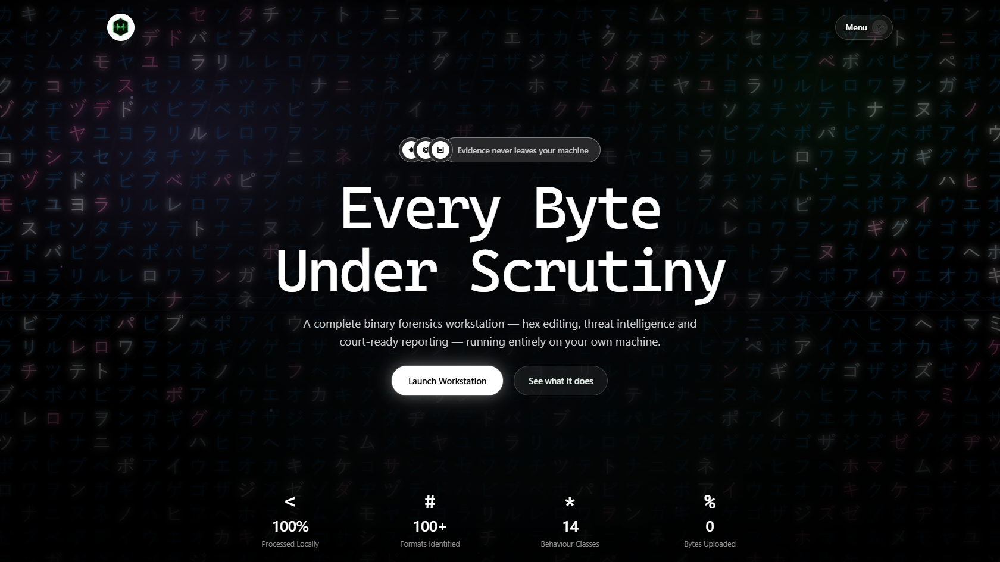

### Capabilities panel

The landing page fits one screen, so the secondary pages open as overlays.

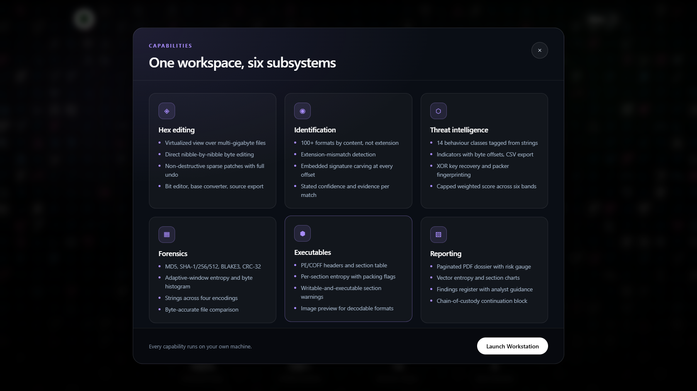

### The workstation before a file is opened

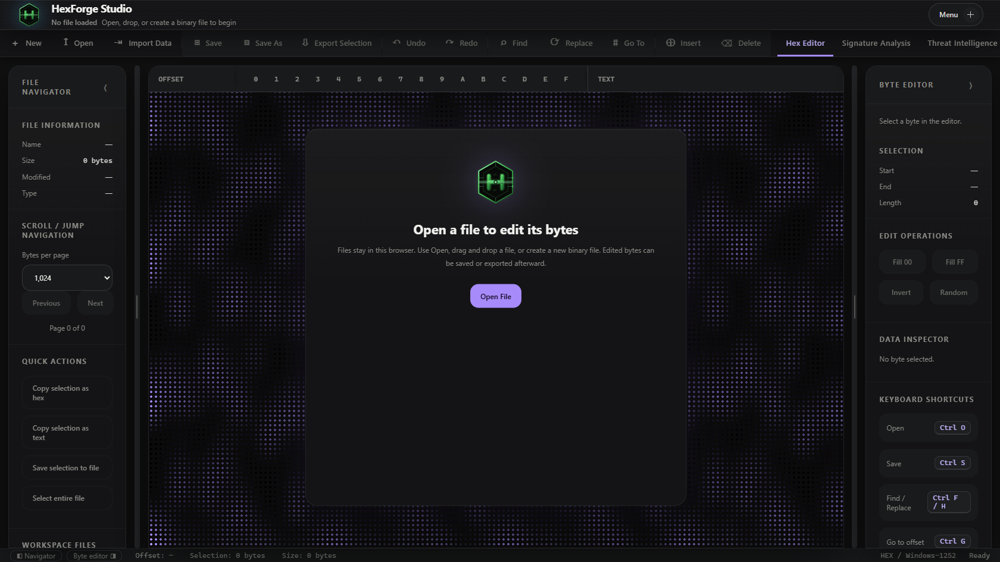

### Hex editor — the main workspace

Every byte of the file, in hexadecimal on the left and as readable text on the right.

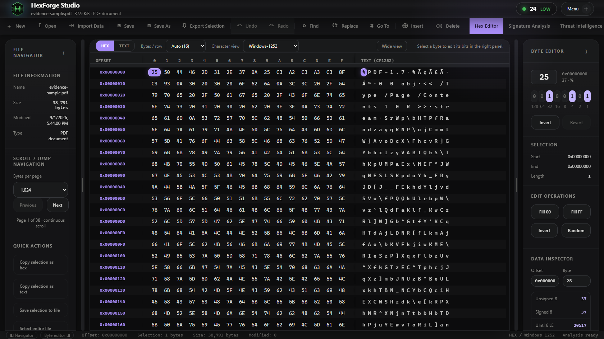

### Byte editor — editing a single byte's bits

Click any byte and the right panel lets you flip individual bits, with the value of each
bit position shown beneath it.

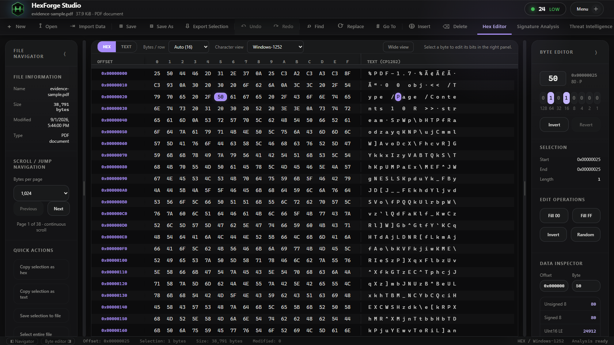

### Signature analysis — what is this file, really?

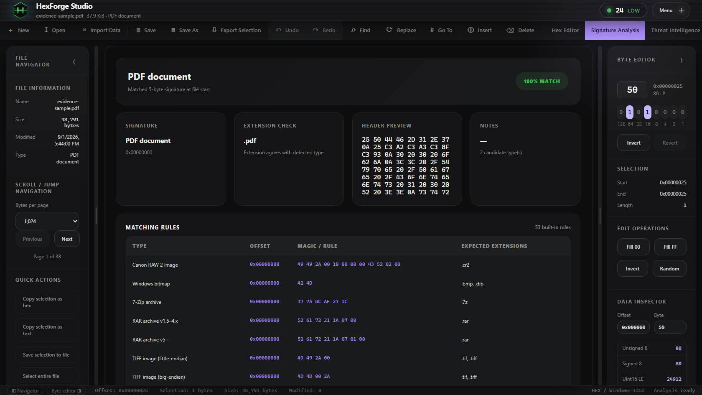

### Threat intelligence — the risk score, and why

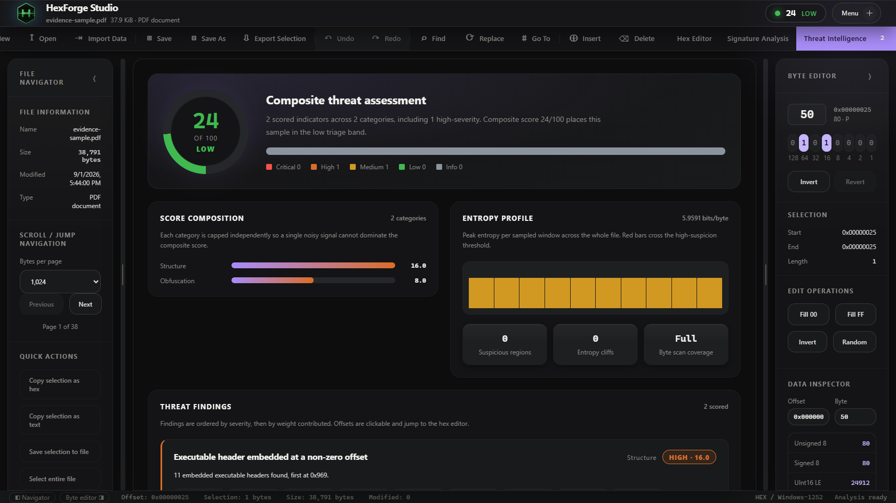

### Forensics lab — hashes, entropy, and strings

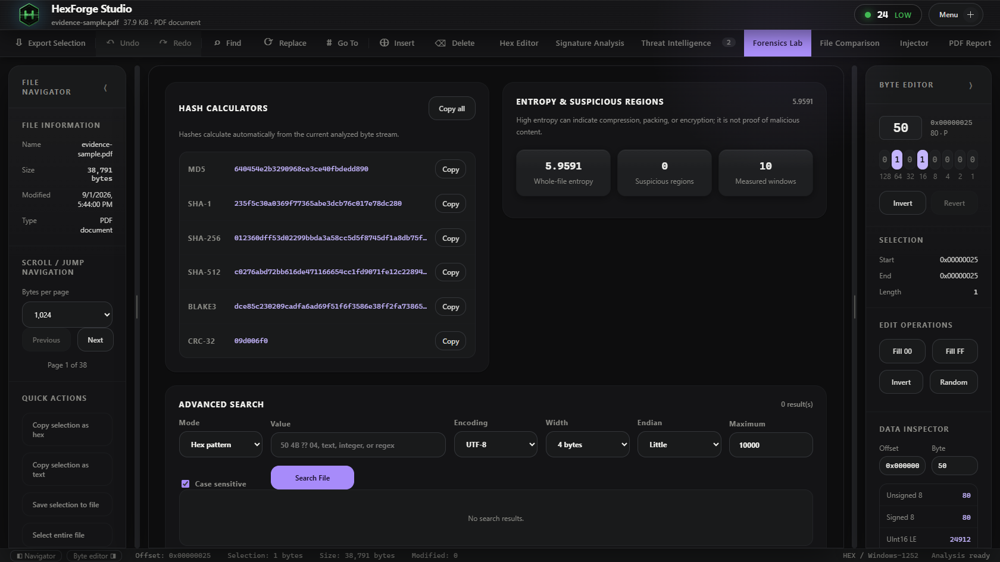

### File comparison — what changed between two files

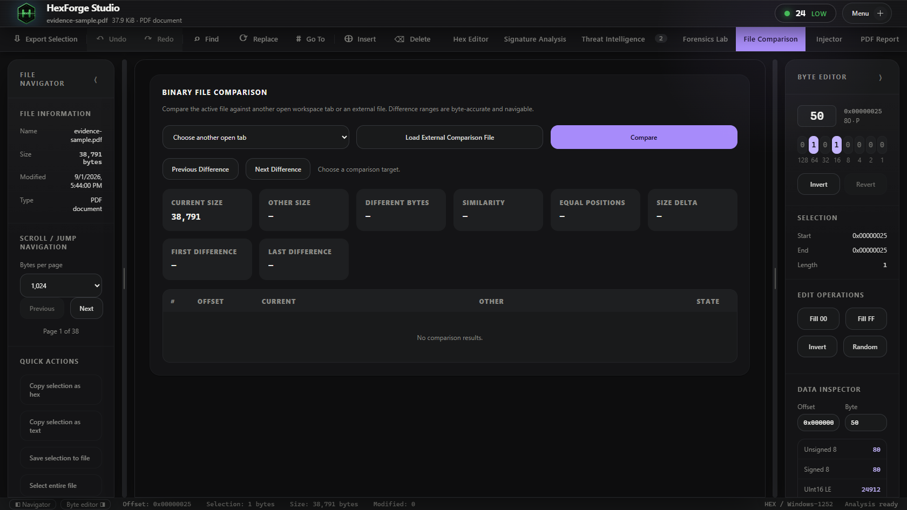

### Injector — the payload library

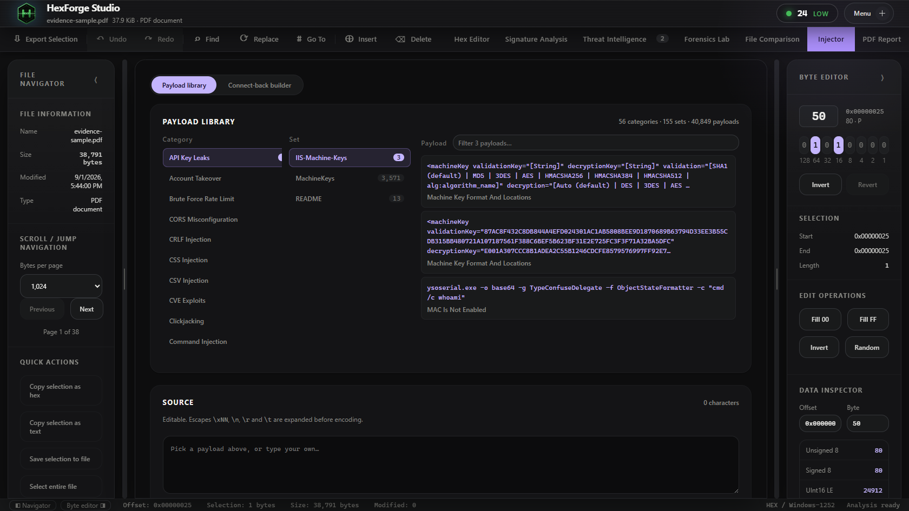

### Injector — the connect-back builder

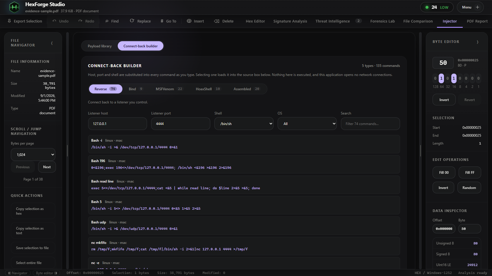

### PE analysis — inside a Windows executable

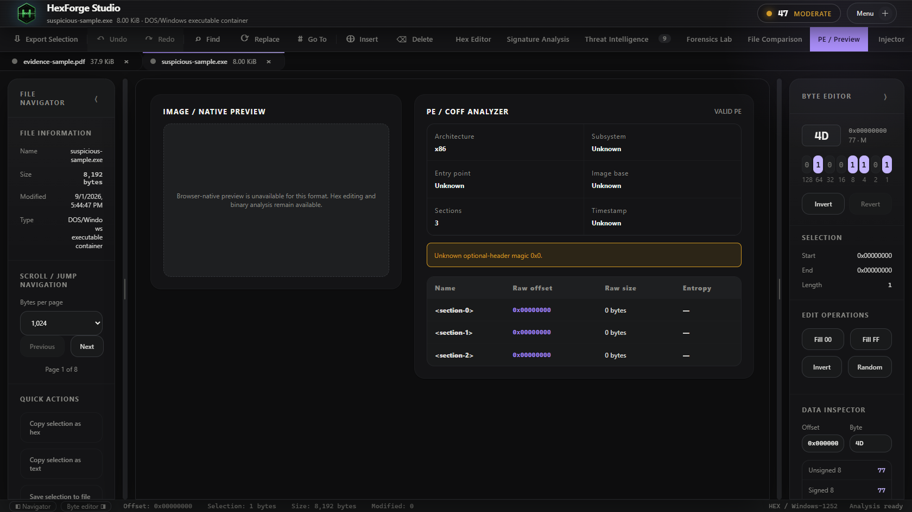

### Threat intelligence on an executable

The same tab with a Windows program loaded, rather than a document — note how much more
there is to report.

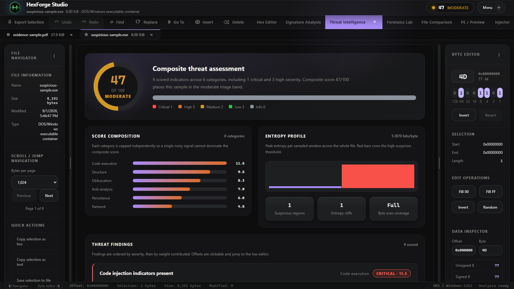

### PDF report — the deliverable

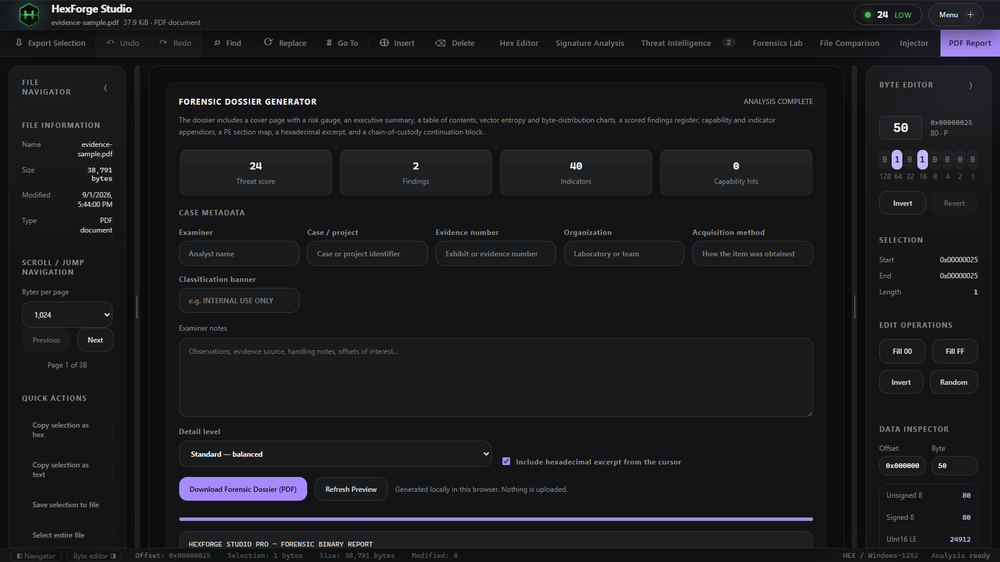

### Wide view

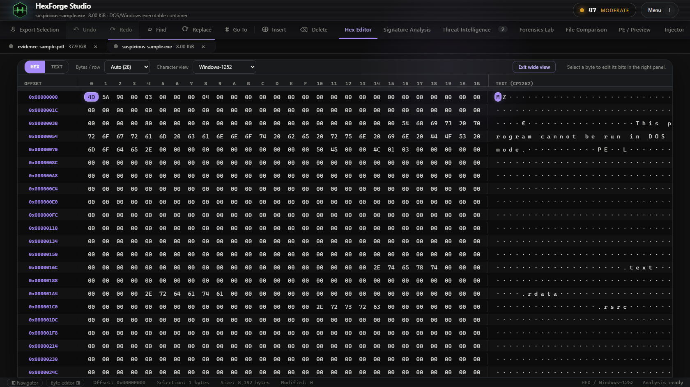

### Regenerating the screenshots

A script drives the whole application and captures every view automatically.

```bash
npm run build                      # build the current interface
npm install -D playwright          # the capture tool (not installed by default)
npx playwright install chromium    # a headless browser, ~150 MB, one time only
node tools/capture-screenshots.mjs # drives every view and writes the PNGs
```

The script generates its own sample files in memory, opens each tab in turn, and writes
sixteen PNGs into `docs/screenshots/`. Nothing on your disk is read or modified.

> If Playwright complains that the browser is missing even after installing it, the npm
> package and the downloaded browser have drifted apart. Point the script at the browser
> you already have:
>
> ```bash
> CHROMIUM_PATH="$HOME/AppData/Local/ms-playwright/chromium-1223/chrome-win64/chrome.exe" >   node tools/capture-screenshots.mjs
> ```

---

## 4. Every tab, explained

Open a file and you get nine tabs across the top. Here is what each one is for, in plain
language.

<details open>
<summary><h3>🔷 Hex Editor — see and change every byte</h3></summary>

**What you are looking at.** Three columns:

```
OFFSET       0  1  2  3  4  5  6  7   8  9  A  B  C  D  E  F    TEXT
0x00000000  25 50 44 46 2D 31 2E 37  0A 25 E2 E3 CF D3 0A 31    %PDF-1.7 .%.....1
    ↑                    ↑                                          ↑
 position          the raw bytes                            those bytes as text
 in the file       in hexadecimal                            (dots = unprintable)
```

- **OFFSET** — how far into the file you are, counted in hexadecimal
- **The middle** — the actual bytes, two hex digits each (`00` to `FF`, i.e. 0–255)
- **TEXT** — the same bytes shown as characters, where they are printable

**What you can do.**

- **Click a byte** to select it; the right panel opens it for editing
- **Type hex digits** to overwrite it — two keystrokes make one byte (`F` then `F` = `FF`)
- **Press `Tab`** to switch to text mode, where each keystroke writes a character
- **Wide view** (button, or press `W`) hides the side panels so the grid fills the window
- **Bytes per row** defaults to **Auto** — it fits as many as your window allows, so a
  wider window shows more of the file rather than more empty space

**Nothing is written to disk until you press Save.** Edits are held as an overlay, so
`Ctrl+Z` always takes you back.

</details>

<details open>
<summary><h3>🔷 Signature Analysis — what kind of file is this?</h3></summary>

File extensions lie. `invoice.pdf` can be a Windows executable that someone renamed.

This tab ignores the name and reads the file's **content**, comparing the opening bytes
against 75 known format signatures. A real PDF starts with `%PDF-`; a Windows program
starts with `MZ`. Those markers cannot be faked without breaking the file.

**What you get:**

- The detected format, with a **confidence percentage** and the evidence for it
- An **extension consistency check** — a loud warning when the name disagrees with the
  content, which is one of the strongest single signals that something is wrong
- **Embedded signatures** — other file formats hidden *inside* this one, such as a ZIP
  buried in the middle of an image

</details>

<details open>
<summary><h3>🔷 Threat Intelligence — should I be worried?</h3></summary>

A single score from **0 to 100**, in six bands from *Minimal* to *Critical*, built from
four independent kinds of evidence:

**1. Capabilities** — text found inside the file matched against 14 categories of
suspicious behaviour:

`anti-debugging` · `sandbox evasion` · `code injection` · `privilege escalation` ·
`persistence` · `credential access` · `keylogging` · `network / C2` · `cryptography` ·
`ransomware` · `discovery` · `defence evasion`

**2. Indicators** — web addresses, IPs, domains, registry keys, file paths,
cryptocurrency wallets and suspicious command lines. **Every one records where it was
found**, so clicking it jumps straight to that byte in the editor. Exports to CSV.

**3. Obfuscation** — signs that a file is deliberately hiding what it does: recovered
XOR keys, packer fingerprints (UPX, Themida, VMProtect and others), cryptographic
constant tables, and shellcode patterns.

**4. Structure** — abrupt entropy changes and executables buried inside other files.

> ### ⚠️ Read this before trusting the number
>
> **The score sorts your samples. It does not judge them.**
>
> Finding the text `CreateRemoteThread` proves that text is *present*. It does not prove
> the program calls it, or that it would ever run. Compiler output, documentation and
> unused library code all trigger matches.
>
> Use the score to decide **what to look at first**. Confirm real behaviour by running
> the sample in an isolated environment.

</details>

<details open>
<summary><h3>🔷 Forensics Lab — hashes, entropy and strings</h3></summary>

**Hashes** — MD5, SHA-1, SHA-256, SHA-512, BLAKE3 and CRC-32. A hash is a fingerprint:
change one byte and it changes completely. Record them **before** you touch anything, so
you can prove the file is unaltered.

**Entropy** — a measure from 0 to 8 of how random the bytes look.

| Reading | Usually means |
|---|---|
| 0–1 | Padding, empty space, long runs of one value |
| 2–5 | Ordinary text, code, structured data |
| 6–7 | Compressed data, images |
| 7.5–8 | Encrypted, packed, or compressed — **worth a look** |

High entropy is **not** proof of anything. A ZIP archive and a packed virus look
identical by this measure.

**Strings** — readable text extracted from the binary, across four text encodings. Often
the fastest way to understand an unknown file.

**Byte histogram** — how often each of the 256 possible byte values appears.

</details>

<details open>
<summary><h3>🔷 File Comparison — what changed?</h3></summary>

Compare the open file against another, byte for byte. Useful for spotting what an update
altered, what a patch changed, or how an infected copy differs from a clean one. Every
difference is clickable and takes you to that offset.

</details>

<details open>
<summary><h3>🔷 PE / Preview — inside Windows executables</h3></summary>

**This tab only appears when it has something to say** — for a Windows program, or an
image the browser can display. For a PDF or an archive it hides itself rather than
showing empty boxes.

For an executable you get its architecture, subsystem, entry point, and the **section
table** with the entropy of each section. Sections that are both *writable and
executable* are flagged automatically — legitimate programs rarely need that, and packers
almost always do.

</details>

<details open>
<summary><h3>🔷 Injector — insert test payloads</h3></summary>

A library of **40,849 known attack strings** across **56 categories**, plus a builder for
connect-back commands. For building test files, checking whether a filter catches known
attacks, and practising on CTF challenges.

**Payload library** — browse by category → set → payload, with a search box.

Covers SQL injection, XSS, command injection, template injection, path traversal, XXE,
SSRF, NoSQL, LDAP, CRLF, open redirect, deserialisation, prototype pollution, request
smuggling, GraphQL, JWT, XPath, and more.

**Connect-back builder** — 135 commands across five types:

| Type | Count | What it is |
|---|---|---|
| Reverse | 74 | The target connects out to you |
| Bind | 9 | The target listens; you connect in |
| MSFVenom | 22 | Metasploit payload generation |
| HoaxShell | 10 | Sessions over plain HTTP |
| Assembled | 20 | Longer multi-step scripts |

Type your IP and port once and every command updates. Long scripts are shown **in full**,
not truncated.

**How injection works.**

1. Pick or type a payload
2. Choose an **encoding** — raw, URL, double-URL, Base64, hex, unicode escapes, HTML
   entities, or UTF-16
3. Choose a **position** — overwrite at cursor, insert at cursor, overwrite the
   selection, insert at a specific offset, or append to the end
4. Check the byte preview, then **Inject**

Every injection is a normal edit, so `Ctrl+Z` undoes it.

> **Scope.** This writes bytes into a file you already have open on your own machine.
> Nothing is executed, no network connection is opened, and nothing is sent anywhere.
> Use it on systems and files you own or are authorised to test.

</details>

<details open>
<summary><h3>🔷 PDF Report — the deliverable</h3></summary>

Produces a paginated PDF with a cover page and risk gauge, executive summary, generated
contents, case metadata and chain-of-custody block, identification evidence, all hashes,
a findings register, capability and indicator appendices, entropy and byte-distribution
charts, the PE section map, a hex excerpt, and a methodology statement.

Charts are drawn as **vectors**, so they stay sharp at any zoom.

</details>

---

## 5. Before you start — installing the prerequisites

You need **Python 3.9 or newer**. That is all, for normal use.

You additionally need **Node.js 20.19+** and **Git** only if you intend to modify the
source code.

### Checking what you already have

Run these in any terminal. If a version number prints, you have it.

```bash
python --version
node --version
git --version
```

> On some Linux and macOS systems the command is `python3`, not `python`.

---

### Installing Python

<details>
<summary><b>Windows</b></summary>

**Option A — winget (built into Windows 10/11):**

```powershell
winget install --id Python.Python.3.12 --source winget
```

**Option B — the installer:** download from [python.org/downloads](https://www.python.org/downloads/).

> ⚠️ **Critical:** on the first screen of the installer, tick **"Add python.exe to
> PATH"** before clicking Install. Almost every "python is not recognised" problem comes
> from skipping this box.

Close and reopen your terminal afterwards, then verify:

```powershell
python --version
```

</details>

<details>
<summary><b>macOS</b></summary>

**Option A — Homebrew (recommended):**

```bash
# install Homebrew itself, if you do not have it
/bin/bash -c "$(curl -fsSL https://raw.githubusercontent.com/Homebrew/install/HEAD/install.sh)"

brew install python@3.12
```

**Option B — the installer:** download from [python.org/downloads](https://www.python.org/downloads/).

Verify:

```bash
python3 --version
```

</details>

<details>
<summary><b>Linux</b></summary>

```bash
# Debian, Ubuntu, Mint, Pop!_OS
sudo apt update && sudo apt install -y python3 python3-venv python3-pip

# Fedora, RHEL, Rocky, Alma
sudo dnf install -y python3 python3-pip

# Arch, Manjaro
sudo pacman -S --noconfirm python python-pip

# openSUSE
sudo zypper install -y python3 python3-pip
```

> **Debian and Ubuntu users:** `python3-venv` is a separate package and this project
> needs it. If you skip it you will hit the `ensurepip is not available` error described
> in [Troubleshooting](#9-troubleshooting--errors-you-may-hit).

Verify:

```bash
python3 --version
```

</details>

---

### Installing Node.js — only if you will edit the code

<details>
<summary><b>Windows</b></summary>

```powershell
winget install --id OpenJS.NodeJS.LTS --source winget
```

Or download the LTS installer from [nodejs.org](https://nodejs.org/).

</details>

<details>
<summary><b>macOS</b></summary>

```bash
brew install node@22
```

</details>

<details>
<summary><b>Linux</b></summary>

Distribution repositories often ship a version older than 20.19. Use NodeSource:

```bash
# Debian / Ubuntu
curl -fsSL https://deb.nodesource.com/setup_22.x | sudo -E bash -
sudo apt install -y nodejs

# Fedora / RHEL
curl -fsSL https://rpm.nodesource.com/setup_22.x | sudo bash -
sudo dnf install -y nodejs

# Arch
sudo pacman -S --noconfirm nodejs npm
```

</details>

---

### Installing Git — only if you will push changes

```powershell
# Windows
winget install --id Git.Git --source winget
```

```bash
# macOS
brew install git

# Debian / Ubuntu
sudo apt install -y git

# Fedora
sudo dnf install -y git

# Arch
sudo pacman -S --noconfirm git
```

---

## 6. Setup — every platform, every shell

The application ships **already built**, so running it needs Python only.

### Step 1 — get the code

<table>
<tr><th align="left" width="200">Shell</th><th align="left">Command</th></tr>
<tr><td><b>Git Bash</b><br>(Windows)</td><td>

```bash
cd ~/Downloads
git clone https://github.com/D3v4nshPat3l/HexForgeStudio.git
cd HexForgeStudio
```
</td></tr>
<tr><td><b>PowerShell</b><br>(Windows)</td><td>

```powershell
cd $HOME\Downloads
git clone https://github.com/D3v4nshPat3l/HexForgeStudio.git
cd HexForgeStudio
```
</td></tr>
<tr><td><b>Command Prompt</b><br>(Windows)</td><td>

```cmd
cd /d %USERPROFILE%\Downloads
git clone https://github.com/D3v4nshPat3l/HexForgeStudio.git
cd HexForgeStudio
```
</td></tr>
<tr><td><b>Terminal</b><br>(macOS / Linux)</td><td>

```bash
cd ~/Downloads
git clone https://github.com/D3v4nshPat3l/HexForgeStudio.git
cd HexForgeStudio
```
</td></tr>
</table>

> **No Git?** Download the ZIP from the repository's green **Code** button, extract it,
> and `cd` into the extracted folder instead.

---

### Step 2 — start it

<table>
<tr><th align="left" width="200">Shell</th><th align="left">Command</th></tr>
<tr><td><b>Git Bash</b></td><td>

```bash
python run.py
```
</td></tr>
<tr><td><b>PowerShell</b></td><td>

```powershell
python run.py
```

Or double-click **`start.bat`** in Explorer.
</td></tr>
<tr><td><b>Command Prompt</b></td><td>

```cmd
python run.py
```

Or simply:

```cmd
start.bat
```
</td></tr>
<tr><td><b>macOS / Linux</b></td><td>

```bash
python3 run.py
```

Or:

```bash
chmod +x start.sh
./start.sh
```
</td></tr>
</table>

### What you will see the first time

```
[hexforge] creating virtual environment in .venv ...
[hexforge] installing server dependencies ...

   HexForge Studio
   running at  http://127.0.0.1:8765/
   press Ctrl+C to stop
```

Your browser opens automatically. If it does not, paste that address in yourself.

**Later runs skip the setup** and start in about a second.

### Useful flags

```bash
python run.py --port 9000      # use a different port
python run.py --no-browser     # start the server without opening a browser
python run.py --verbose        # print every request, for debugging
```

### Stopping it

Press **`Ctrl+C`** in the terminal.

---

### Step 3 (optional) — set up for development

Only needed if you plan to change the TypeScript source.

```bash
npm install          # install the build tools
npm run dev          # live-reloading dev server, usually http://localhost:5173
npm run typecheck    # check types without building
npm test             # run the test suite
npm run build        # produce the production build in dist/
```

After `npm run build`, `python run.py` serves your new build.

---

## 7. Daily use

1. **Start it** — `python run.py`
2. **Click "Launch Workstation"** on the landing page
3. **Open a file** — the Open button, or drag and drop it anywhere on the window
4. **Wait a moment** — the status bar bottom-right shows *Analysis ready*
5. **Read the score** top-right, then work through the tabs
6. **Export a report** from the PDF Report tab when you are done

### A suggested investigation order

```
Signature Analysis  →  is it what it claims to be?
        ↓
Threat Intelligence →  is anything alarming inside?
        ↓
Forensics Lab       →  record the hashes, look at the strings
        ↓
Hex Editor          →  inspect the specific offsets that were flagged
        ↓
PDF Report          →  write it up
```

---

## 8. Keyboard shortcuts

### While in the hex grid

| Key | Action |
|---|---|
| `0`–`9`, `A`–`F` | Edit the byte under the cursor, one nibble per keystroke |
| Any character | Write a byte (text mode) |
| `Tab` | Switch between hex and text editing |
| `←` `→` `↑` `↓` | Move the cursor |
| `Shift` + arrows | Extend the selection |
| `Home` / `End` | Jump to the start / end of the row |
| `Ctrl` + `Home` / `End` | Jump to the start / end of the file |
| `Page Up` / `Page Down` | Move a page at a time |
| `Delete` | Zero the byte under the cursor |
| `Backspace` | Zero the previous byte and step back |
| `Esc` | Cancel a half-typed byte |
| `W` | Toggle wide view |

### Anywhere in the application

| Key | Action |
|---|---|
| `Ctrl` + `O` | Open a file |
| `Ctrl` + `S` | Save |
| `Ctrl` + `Shift` + `S` | Save as |
| `Ctrl` + `F` | Find |
| `Ctrl` + `H` | Replace |
| `Ctrl` + `G` | Go to offset |
| `Ctrl` + `Z` / `Ctrl` + `Y` | Undo / redo |
| `Ctrl` + `A` | Select the whole file |

---

## 9. Troubleshooting — errors you may hit

<details open>
<summary><b>❌ <code>'python' is not recognized as an internal or external command</code></b></summary>

**Windows.** Python is either missing, or it was installed without being added to PATH.

**Try `py` first** — the Windows Python launcher is often present even when `python` is not:

```powershell
py --version
py run.py
```

**If that fails, reinstall** and tick **"Add python.exe to PATH"** on the first installer
screen:

```powershell
winget install --id Python.Python.3.12 --source winget
```

**Then close and reopen your terminal** — PATH changes do not apply to windows that were
already open.

</details>

<details open>
<summary><b>❌ <code>python: command not found</code></b></summary>

**macOS and Linux.** The command is `python3` on most systems:

```bash
python3 run.py
```

If `python3` is also missing, install it using the commands in
[section 5](#installing-python).

</details>

<details open>
<summary><b>❌ <code>ensurepip is not available</code> / <code>Failed to create the virtual environment</code></b></summary>

**Debian, Ubuntu and derivatives.** These ship Python's `venv` module as a separate
package:

```bash
sudo apt update && sudo apt install -y python3-venv
```

Then delete the half-made environment and try again:

```bash
rm -rf .venv
python3 run.py
```

</details>

<details open>
<summary><b>❌ <code>dist/ is missing or empty</code></b></summary>

You have the source but not the built application — usually after cloning with `dist/`
excluded.

```bash
npm install
npm run build
python run.py
```

This needs Node.js; see [section 5](#installing-nodejs--only-if-you-will-edit-the-code).

</details>

<details open>
<summary><b>❌ Port already in use / the page will not load</b></summary>

The launcher normally detects a busy port and picks a free one. To choose explicitly:

```bash
python run.py --port 9000
```

To find what is holding the default port:

```powershell
# Windows PowerShell
Get-NetTCPConnection -LocalPort 8765 | Select-Object OwningProcess
```

```bash
# macOS / Linux
lsof -i :8765
```

</details>

<details open>
<summary><b>❌ The file opens but stays stuck on "Analyzing…"</b></summary>

This means the background analysis worker failed to start. Open your browser's developer
console (`F12`) and look for:

```
Failed to load module script: ... MIME type of "video/mp2t"
```

That means the server is sending TypeScript source instead of compiled JavaScript.
Rebuild:

```bash
npm run build
```

If you are not able to rebuild, the application falls back to analysing on the main
thread — slower, but it will still finish.

</details>

<details open>
<summary><b>❌ <code>PermissionError</code> when creating <code>.venv</code></b></summary>

You are in a directory your user cannot write to. Move the project somewhere you own:

```bash
# macOS / Linux
mv HexForgeStudio ~/HexForgeStudio && cd ~/HexForgeStudio
```

```powershell
# Windows PowerShell
Move-Item HexForgeStudio $HOME\HexForgeStudio; cd $HOME\HexForgeStudio
```

Do **not** run it with `sudo` or as Administrator — it does not need those rights.

</details>

<details open>
<summary><b>❌ <code>npm ERR! code EBADENGINE</code></b></summary>

Your Node.js is older than 20.19. Check and upgrade:

```bash
node --version
```

Use the install commands in
[section 5](#installing-nodejs--only-if-you-will-edit-the-code).

</details>

<details open>
<summary><b>❌ Windows Defender or SmartScreen warns about the payload files</b></summary>

Expected, and harmless. `public/payloads.json` contains 40,849 **strings** describing
known attack patterns. Antivirus software pattern-matches those strings and flags the
file even though it is inert data that is never executed.

You may add an exclusion for the project folder, or ignore the warning. Nothing in this
project runs a payload.

</details>

<details open>
<summary><b>❌ A large file makes the browser slow</b></summary>

Hashing and entropy read the entire file, so a multi-gigabyte input takes time. The hex
editor itself stays responsive at any size because it only renders visible rows.

For very large files, use **Wide view** (`W`) to reduce the interface around the grid.

</details>

<details open>
<summary><b>❌ The screenshots in this README look wrong</b></summary>

They were captured from an earlier build. Regenerate them:

```bash
npm run build
npx playwright install chromium
node tools/capture-screenshots.mjs
```

</details>

---

## 10. Project structure

```
HexForgeStudio/
│
├── run.py                      ← START HERE: builds .venv, then serves
├── start.bat                   ← Windows double-click launcher
├── start.sh                    ← macOS / Linux launcher
├── requirements.txt
│
├── launcher/
│   └── serve.py                ← loopback-only static server, standard library only
│
├── dist/                       ← the built application (served as-is)
├── public/
│   ├── payloads.json           ← 40,849 test payloads (4.4 MB, loaded on demand)
│   ├── revshells.json          ← 135 connect-back commands
│   └── favicon.svg, logo-mark.svg, site.webmanifest
│
├── src/                        ← TypeScript source
│   ├── entry.ts                ← routes between landing and workstation
│   ├── landing.ts / .css       ← the front page
│   ├── main.ts                 ← the workstation: shell, hex grid, all views
│   ├── worker.ts               ← background analysis thread
│   ├── auto-analyzer.ts        ← the analysis pipeline
│   ├── analyzers/              ← signatures, hashes, entropy, strings, PE,
│   │                              capabilities, indicators, obfuscation, threat,
│   │                              payloads, payload-library, shell-library
│   ├── report/                 ← PDF generation and vector charts
│   └── ui/                     ← byte editor, injector, buttons, tabs
│
├── tools/
│   ├── build-payloads.py       ← rebuilds payloads.json from an archive
│   ├── build-revshells.py      ← rebuilds revshells.json
│   └── capture-screenshots.mjs ← regenerates docs/screenshots
│
├── docs/screenshots/           ← the images in this README
├── vercel.json                 ← deployment configuration
└── THIRD-PARTY-LICENSES.txt    ← required notices — do not delete
```

---

## 11. Deploying to Vercel

The project is deployment-ready: `vercel.json` already sets the build command, output
directory, security headers and asset caching.

### Through the website

1. Go to **[vercel.com/new](https://vercel.com/new)**
2. Connect your GitHub account and **import `HexForgeStudio`**
3. **Leave the build settings alone** — Vercel reads `vercel.json` and fills them in
4. Open **Settings → General → Node.js Version** and choose **22.x**
   *(this is the one setting worth changing by hand — the default may be too old)*
5. Click **Deploy** and wait a minute or two

### Through the command line

```bash
npm install -g vercel
vercel login
vercel --prod
```

### After deploying, check it works

Open the URL, click **Launch Workstation**, open any file, and confirm the status bar
reaches *Analysis ready*. If it stays on *Analyzing…*, the worker script did not build
correctly — rebuild locally and push again.

> Every push to `main` deploys automatically. Other branches get their own preview URLs.

---

## 12. Pushing your changes

Run these from the project folder in **Git Bash**.

### First time only — tell Git who you are

```bash
git config --global user.name "Devansh Patel"
git config --global user.email "your-email@example.com"
```

### The normal cycle

```bash
# 1. see what changed
git status

# 2. stage everything
git add -A

# 3. commit with a message describing what and why
git commit -m "Update README with full documentation and screenshots"

# 4. push
git push origin main
```

### As a single line

```bash
git add -A && git commit -m "Update README with full documentation and screenshots" && git push origin main
```

### If you changed the interface, rebuild first

The built application lives in `dist/`, so it must be regenerated before committing:

```bash
npm run build && git add -A && git commit -m "Rebuild after interface changes" && git push origin main
```

### Common Git problems

<details>
<summary><b>❌ <code>Updates were rejected because the remote contains work that you do not have</code></b></summary>

Someone (or you, elsewhere) pushed changes you do not have locally.

```bash
git pull --rebase origin main
git push origin main
```

</details>

<details>
<summary><b>❌ <code>Authentication failed</code> / it asks for a password</b></summary>

GitHub no longer accepts account passwords over HTTPS. Create a **personal access token**
at [github.com/settings/tokens](https://github.com/settings/tokens) (classic token, with
the `repo` scope) and paste that as the password.

To avoid retyping it:

```bash
git config --global credential.helper store
```

</details>

<details>
<summary><b>❌ <code>LF will be replaced by CRLF</code> warnings</b></summary>

Harmless line-ending notices on Windows. To silence them:

```bash
git config --global core.autocrlf true
```

</details>

<details>
<summary><b>❌ You committed something you did not mean to</b></summary>

```bash
# undo the last commit but keep your file changes
git reset --soft HEAD~1
```

</details>

---

## 13. Limitations and honest caveats

HexForge Studio is an **analysis aid**. It is not accredited forensic software, not an
antivirus, and not a substitute for expert judgement.

**What it does not do:**

- Run, emulate, unpack, decrypt or sandbox anything
- Read files *inside* archives or disk images
- Check indicators against live threat-intelligence feeds
- Analyse imports or control flow

**How to read the results:**

- **High entropy is not suspicious on its own.** Compression and encryption produce the
  same reading as packing.
- **Signature matches inside containers are normal.** A ZIP legitimately contains other
  formats.
- **Indicator strings appear in ordinary software constantly.** An IP address in a file
  is not evidence of anything by itself.
- **The threat score is a sorting tool.** It tells you what to examine first, not what is
  malicious.

Handle files designed to exhaust resources — decompression bombs, parser abuse — inside
an isolated environment.

---

## 14. Licence and credits

**Copyright © 2026 Devansh Patel. All rights reserved.**
This project is not released under an open-source licence. See [LICENSE](LICENSE).

### Bundled third-party data

Two datasets are included under the MIT licence, which requires their copyright notices
to travel with them. Both notices are in **[THIRD-PARTY-LICENSES.txt](THIRD-PARTY-LICENSES.txt)**.

| Data file | Contents |
|---|---|
| `public/payloads.json` | The test-payload library |
| `public/revshells.json` | The connect-back command set |

> ⚠️ **Do not delete `THIRD-PARTY-LICENSES.txt`.** Shipping that data without its notices
> would breach the licence terms. It is a file in the repository and appears nowhere in
> the interface.

<div align="center">
<br>
<sub><b>HexForge Studio</b> — your bytes never leave your machine.</sub>
</div>
