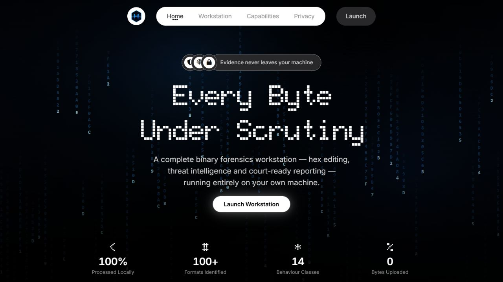
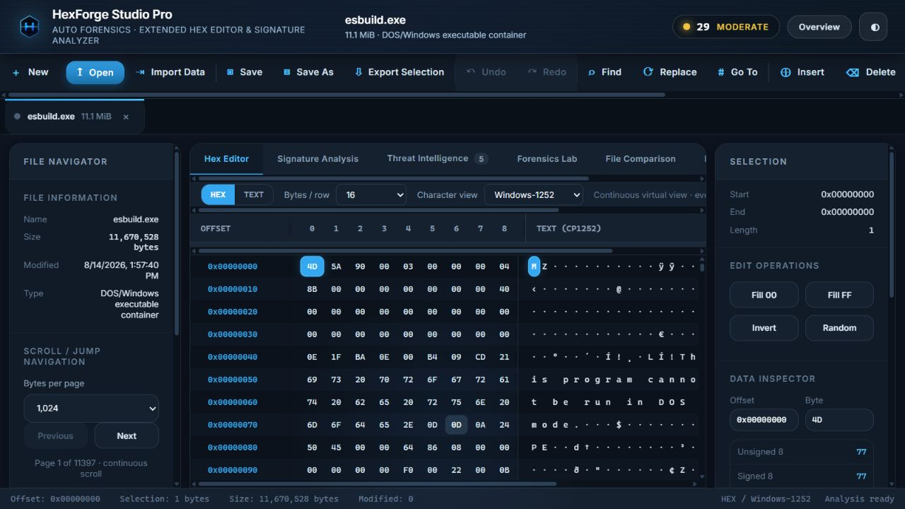
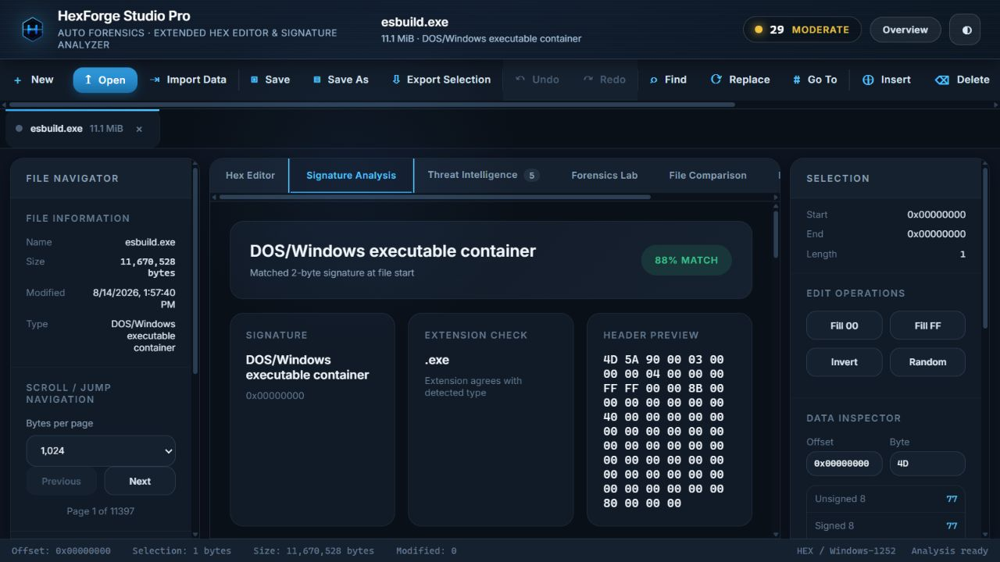
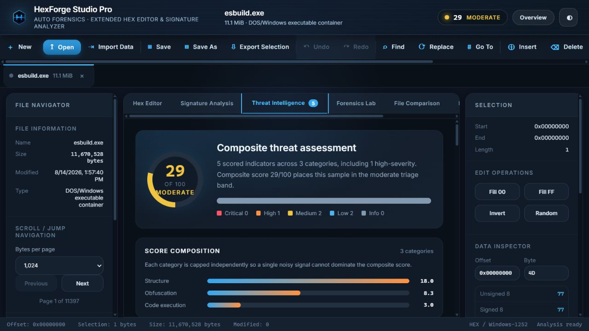
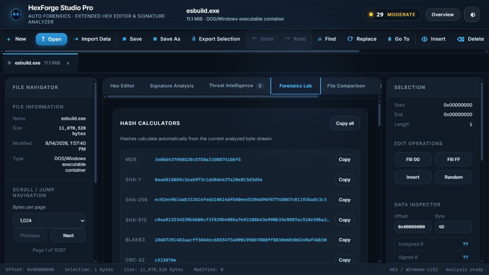
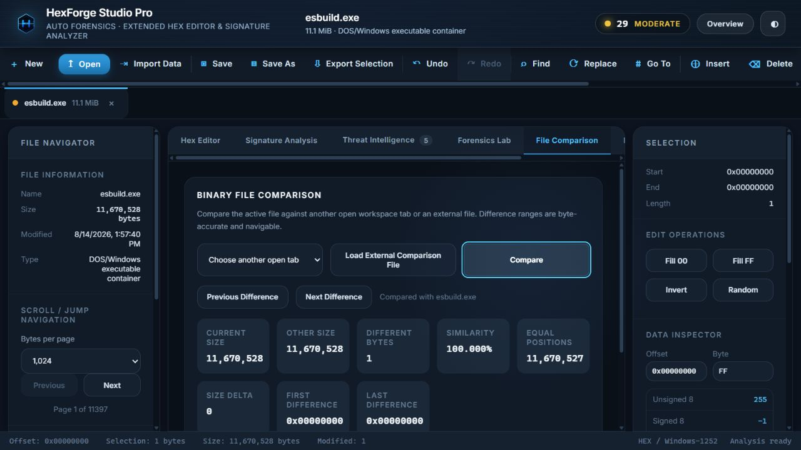
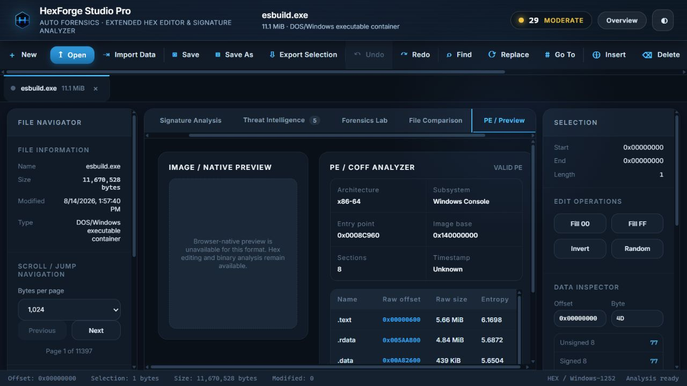
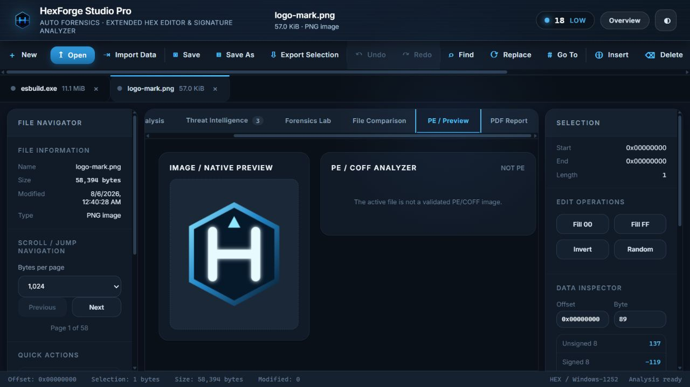
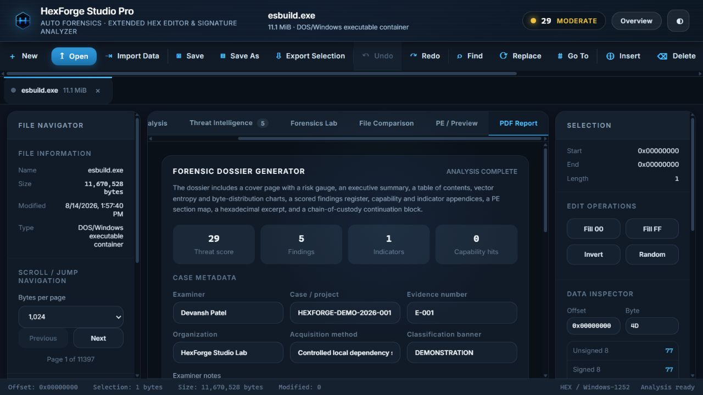
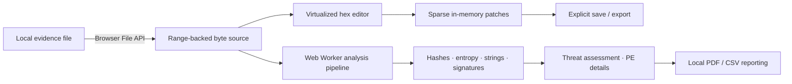

<div align="center">


# HexForge Studio Pro

### A local-first workstation for hex editing, binary forensics, threat triage, and evidence reporting

<p>
  
  
  
  
  
</p>

**No account · no sample upload · no telemetry · no server-side analysis · works offline**

[Quick start](#quick-start) · [Screenshots](#the-workstation) · [Investigation proof](#verified-investigation) · [Features](#feature-reference) · [Build](#build-from-source) · [Architecture](#architecture) · [FAQ](#faq)

</div>



> [!NOTE]
> HexForge reads the selected file through the browser File API and performs analysis in your browser process. The bundled Python program only serves static application files on `127.0.0.1`; it never receives the evidence file.

## Why HexForge

Binary investigation usually means switching among a hex editor, hashing tools, signature databases, string extractors, entropy visualizers, executable parsers, diff utilities, and report generators. HexForge brings those workflows into one coherent workstation without requiring the analyst to upload evidence to a third party.

<table>
<tr>
<td width="25%" valign="top"><b>Private by design</b><br><sub>Files remain inside the local browser process. The app has no upload endpoint, analytics package, or account system.</sub></td>
<td width="25%" valign="top"><b>Investigation ready</b><br><sub>Automatic identification, six hashes, entropy, strings, IOCs, capabilities, obfuscation signals, and PE structure.</sub></td>
<td width="25%" valign="top"><b>Non-destructive editing</b><br><sub>Sparse byte patches, full undo/redo, range reads, virtualized rendering, and explicit export preserve the original file.</sub></td>
<td width="25%" valign="top"><b>Handover quality</b><br><sub>Generate a paginated PDF dossier with case metadata, findings, charts, hashes, offsets, and chain-of-custody fields.</sub></td>
</tr>
</table>

## Quick start

### Run the release archive — no Node.js required

Requirements:

- Python **3.9 or newer**
- A current Chrome, Edge, Firefox, or Safari release
- The extracted archive, including its prebuilt `dist/` directory

#### Windows

Double-click `start.bat`, or run:

```bat
python run.py
```

#### Linux / macOS

```bash
chmod +x start.sh
./start.sh
```

Or:

```bash
python3 run.py
```

HexForge creates an isolated `.venv/`, starts a loopback-only static server, opens `http://127.0.0.1:8765/`, and prints the exact address. There are currently no third-party Python packages to download, so first launch is offline-safe.

### Launcher options

| Option | Purpose |
|---|---|
| `--port 9000` | Prefer another local port; HexForge selects a free one if it is occupied. |
| `--no-browser` | Start the server without opening a browser automatically. |
| `--verbose` | Print every local static-file request. |

### First investigation

1. Select **Launch Workstation**.
2. Select **Open**, choose one or more files, or drag them onto the window.
3. Wait for the footer to show **Analysis ready**.
4. Move through Signature Analysis, Threat Intelligence, Forensics Lab, PE / Preview, and PDF Report.
5. Treat every automated finding as a lead. Validate it with a format-specific or dynamic-analysis tool before making an operational decision.

## Verified investigation

Every main screenshot below was captured from a real end-to-end run on 14 August 2026. The controlled sample was the Windows `esbuild.exe` binary installed by the repository's locked development dependency `@esbuild/win32-x64@0.28.1`.

| Property | Observed result |
|---|---|
| File | `esbuild.exe` — benign JavaScript bundler executable |
| Size | `11,670,528` bytes (`11.1 MiB`) |
| SHA-256 | `ec02ee9b14ab332416fedd10614dfb80eed5304d94f67745067c011934a8c3c3` |
| Identification | DOS/Windows executable container, `88%` signature confidence |
| PE structure | x86-64, Windows Console, 8 sections, entry point `0x0008C960` |
| Threat triage | `29/100` Moderate; 5 scored findings across 3 categories |
| Forensic summary | Whole-file entropy `6.26382`; 6 hashes; 30,000 extracted strings |
| Comparison proof | One controlled byte changed at `0x00000000`; exactly 1 differing byte detected, then undone |
| Automated verification | TypeScript check passed; 19/19 tests passed; production build passed |

> [!IMPORTANT]
> The sample is a legitimate build tool, yet byte-pattern and entropy heuristics produced a Moderate score. That is intentional evidence of the tool's interpretation boundary: **the score prioritizes review; it does not declare a file malicious.**

To reproduce the screenshot sample from source on Windows:

```powershell
npm ci
Get-FileHash .\node_modules\@esbuild\win32-x64\esbuild.exe -Algorithm SHA256
```

## The workstation

### 1 · Hex Editor

Virtualized, continuous access to the byte stream with nibble-aware editing, text mode, sparse patches, configurable row widths, Windows-1252/ASCII/Latin-1 views, selection tools, a live numeric inspector, undo/redo, insert/delete, fill, invert, randomize, and source-code export.



### 2 · Signature Analysis

Identifies content from magic bytes and structural probes rather than trusting the extension. HexForge reports confidence, evidence, candidate types, extension consistency, header bytes, and the matching rule set.



### 3 · Threat Intelligence

Combines independently capped structure, obfuscation, code-execution, indicator, capability, and metadata signals into a 0–100 triage score. Every finding includes severity, weight, evidence, offsets, and analyst guidance.



### 4 · Forensics Lab

Computes MD5, SHA-1, SHA-256, SHA-512, BLAKE3, and CRC-32; maps windowed Shannon entropy; builds the 256-byte histogram; extracts four string encodings with offsets; performs typed searches; and scans the complete file for embedded signatures.



### 5 · File Comparison

Compares the active byte stream with another workspace tab or an external file. Difference ranges are navigable and report current/other size, different bytes, equal positions, similarity, size delta, and first/last difference.



### 6 · PE / Preview

Validates PE/COFF structure, architecture, subsystem, entry point, image base, timestamp, section layout, permissions, raw offsets, sizes, and per-section entropy. Browser-decodable images receive an immediate local preview.

<table>
<tr>
<td width="50%"><br><sub><b>PE / COFF analysis</b> — validated x86-64 structure and section entropy.</sub></td>
<td width="50%"><br><sub><b>Native preview</b> — local PNG decoding with the same byte inspector.</sub></td>
</tr>
</table>

### 7 · PDF Report

Builds a local forensic dossier with analyst and case metadata, a risk gauge, executive summary, contents page, integrity hashes, findings register, indicators, capabilities, entropy and histogram charts, PE map, hex excerpt, methodology, and chain-of-custody continuation block.



## Feature reference

### Analysis pipeline

| Stage | What HexForge produces |
|---|---|
| Identification | Magic-byte matches, structural format probes, confidence, extension mismatch detection, embedded signatures |
| Integrity | MD5, SHA-1, SHA-256, SHA-512, BLAKE3, CRC-32 using streaming chunks |
| Statistical | Whole-file entropy, adaptive entropy windows, suspicious regions, entropy cliffs, 256-bucket histogram |
| Strings | ASCII, UTF-8, UTF-16LE, UTF-16BE with byte offsets and filters |
| Indicators | URLs, IP addresses, domains, emails, registry keys, paths, GUIDs, wallets, user agents, Base64, command lines |
| Capabilities | 14 behavior classes including injection, persistence, credential access, anti-debugging, discovery, and C2 |
| Obfuscation | XOR-key recovery, packer fingerprints, cryptographic constants, shellcode-like patterns, high-entropy regions |
| Executables | PE headers, x86/x64 architecture, subsystem, entry point, image base, sections, permissions, section entropy |
| Reporting | PDF dossier and CSV exports for indicators, strings, and embedded signatures |

### Search modes

| Mode | Examples |
|---|---|
| Hex pattern | `4D 5A ?? 00` with `??` wildcards |
| Text | Case-sensitive or insensitive ASCII, UTF-8, UTF-16LE, UTF-16BE |
| Regular expression | Text-oriented expressions on files up to the documented 64 MiB mapping limit |
| Integers | Signed/unsigned 1, 2, 4, or 8-byte values in either byte order |
| Floating point | 32-bit or 64-bit values in little- or big-endian order |

### Editing and export

- Nibble-by-nibble hex entry and direct text entry
- Byte selection with mouse or keyboard
- Overwrite, insert, delete, fill `00`, fill `FF`, invert, and randomize
- Full labeled undo and redo history
- Copy/save a selection or export the effective patched file
- Export as C, Python, Rust, Go, Java, JavaScript, Base64, raw hex, or binary
- Bit editor and arbitrary radix 2–36 converter
- Multiple independent files in workspace tabs

## Format support

Every regular file can be opened as bytes, edited, searched, hashed, compared, and reported. Specialized identification or parsing is available for more than 100 extensions and format families, including:

- Images and camera formats: PNG, JPEG, GIF, BMP, ICO, TIFF, CR2, DNG, NEF, ARW, ORF, RW2, RAF, CR3, PSD, SVG, JPEG 2000, OpenEXR
- Archives and compression: ZIP and ZIP-derived containers, GZIP, BZIP2, XZ, 7-Zip, RAR, CAB, TAR
- Executables and firmware: PE/COFF, ELF, Mach-O, Java Class, Android DEX, EFI/UEFI, U-Boot, Linux bzImage, Intel HEX, Motorola S-record
- Disk and virtual-disk formats: ISO 9660, DMG, VHD, VHDX, QCOW2
- Audio/video: WAV, FLAC, OGG, AAC, AIFF, MIDI, AVI, MKV, WebM, MPEG, FLV, WMV/ASF, MP3
- Documents and text: PDF, PostScript/EPS, EPUB, CHM, DjVu, XML, HTML, JSON, CSV, plain text, ODS, ODP

See [SUPPORTED_FORMATS.md](SUPPORTED_FORMATS.md) for the full compatibility statement and [KNOWN_LIMITATIONS.md](KNOWN_LIMITATIONS.md) for the boundaries between raw-byte support, identification, structural parsing, decompression, and visual decoding.

## Architecture



The important boundary is simple: the Python launcher serves compiled HTML, CSS, JavaScript, worker, and WebAssembly assets. The browser opens the evidence file directly, reads ranges with `Blob.slice()`, performs intensive analysis in a Web Worker, and returns only local UI state. Edited bytes are sparse overlays until the analyst explicitly saves or exports.

For implementation detail, see [ARCHITECTURE.md](ARCHITECTURE.md).

## Privacy and trust model

- The server binds to `127.0.0.1`, not every network interface.
- There is no upload API, database, authentication service, analytics SDK, crash reporter, or telemetry client.
- Runtime assets are bundled locally; the application HTML makes no third-party font, icon, or CDN requests.
- Evidence is represented by the browser's local `File` object and read in ranges.
- Closing the tab ends the in-memory session unless the analyst exported a result.
- Generated reports and CSV files are created in the browser and downloaded directly to the analyst's device.

You can verify the network boundary yourself: start HexForge, open browser developer tools, disconnect the network, reload the local address, and analyze a file. The workstation remains functional because all runtime assets are in `dist/`.

## Build from source

### Requirements

- Node.js `>=20.19.0`
- npm `>=10.0.0`
- Python `>=3.9` for the release-style local server

### Development server

```bash
npm ci
npm run dev
```

Vite prints the local development URL. Source and styles reload as you edit.

### Production build

```bash
npm run typecheck
npm test
npm run build
python run.py
```

The production output is written to `dist/`. Keep that directory in release archives so users can run HexForge with Python alone.

### Verification baseline

This release was validated with:

```text
TypeScript check  PASS
Test files       2 passed
Tests            19 passed
Production build PASS — 280 modules transformed
Local smoke test PASS — all seven workspaces exercised
```

The build currently emits one non-fatal Vite advisory: `byte-source.ts` is imported both statically and dynamically, so that module remains in its current chunk. It does not affect correctness.

## Project layout

```text
HexForgeStudio/
├── dist/                     prebuilt offline-capable application
├── docs/screenshots/         verified product and investigation captures
├── launcher/serve.py         dependency-free loopback static server
├── public/                   logo, favicon, and web manifest
├── src/
│   ├── analyzers/            signatures, hashes, entropy, IOCs, PE, threat logic
│   ├── report/               PDF dossier writer and vector charts
│   ├── main.ts               workstation state, editing, tabs, and views
│   ├── worker.ts             off-main-thread analysis/search/comparison
│   └── entry.ts              hash router and lazy workstation loading
├── package.json              scripts, engines, and locked dependencies
├── run.py                    cross-platform bootstrap launcher
├── start.bat                 Windows convenience launcher
├── start.sh                  Linux/macOS convenience launcher
└── vite.config.ts            production and worker build configuration
```

## Keyboard reference

| Key | Action |
|---|---|
| `0`–`9`, `A`–`F` | Enter a byte nibble in hex mode |
| Any printable character | Write a byte in text mode |
| `Tab` | Toggle hex and text input |
| Arrow keys | Move the cursor |
| `Shift` + arrows | Extend the selection |
| `Home` / `End` | Move to the start/end of the row |
| `Ctrl` + `Home` / `End` | Move to the start/end of the file |
| `Page Up` / `Page Down` | Move by one page |
| `Delete` / `Backspace` | Zero the current/previous byte |
| `Esc` | Cancel a half-entered byte |
| `Ctrl` + `O` | Open files |
| `Ctrl` + `S` | Save |
| `Ctrl` + `Shift` + `S` | Save as |
| `Ctrl` + `F` / `H` | Find / replace |
| `Ctrl` + `G` | Go to offset |
| `Ctrl` + `Z` / `Y` | Undo / redo |
| `Ctrl` + `A` | Select the entire file |

## Operational limitations

HexForge is a forensic analysis aid, not an antivirus verdict engine or accredited evidence suite.

- Capability and IOC detection is lexical; presence does not prove reachability or execution.
- Byte-pattern detections can occur naturally in compiled or compressed data.
- Browser-native preview depends on the decoder shipped by the user's browser.
- Archive content extraction and filesystem mounting are not implemented.
- Proprietary, encrypted, damaged, undocumented, and vendor-specific variants cannot be guaranteed.
- Regex search is capped at 64 MiB because character-to-byte offset mapping is expensive.
- Large tables are capped in PDF reports to preserve responsiveness and readability.
- For formal evidence handling, preserve the original media, document acquisition, verify hashes independently, and corroborate important findings with specialist tools.

## Troubleshooting

<details>
<summary><b><code>python</code> is not recognized</b></summary>

Install Python 3.9 or newer, enable the installer's **Add Python to PATH** option, reopen the terminal, and run `python --version`.

</details>

<details>
<summary><b>Linux reports that <code>venv</code> is unavailable</b></summary>

Install your distribution's virtual-environment package. On Debian/Ubuntu:

```bash
sudo apt install python3-venv
```

</details>

<details>
<summary><b>The requested port is occupied</b></summary>

HexForge automatically falls back to a free loopback port and prints the actual URL. You may also choose one explicitly with `python run.py --port 9000`.

</details>

<details>
<summary><b>The page is blank or worker analysis does not start</b></summary>

Do not open `dist/index.html` with a `file://` URL. Start `run.py` so modules, workers, MIME types, and WebAssembly are served correctly. If the archive is a source-only checkout, run `npm ci && npm run build` first.

</details>

<details>
<summary><b>A very large sample feels slow</b></summary>

Initial hashing and complete-file scans must read the byte stream once. Keep the tab in the foreground during the first pass, close unrelated high-memory tabs, and use byte/text search rather than regex for very large inputs.

</details>

## FAQ

**Does HexForge upload files?**  
No. The browser opens the local file directly; the Python server never receives the sample.

**Can it run on an air-gapped workstation?**  
Yes. The release archive includes `dist/`, has no third-party Python runtime dependency, and no longer references CDN-hosted UI assets.

**Does a high threat score prove malware?**  
No. It means multiple triage signals deserve analyst attention. Dynamic behavior and contextual validation remain essential.

**Can it edit multi-gigabyte files?**  
The editor virtualizes visible rows and uses range reads, so file size does not require rendering or storing every byte at once. Full-file analysis still takes time proportional to the bytes read.

**Why a browser UI?**  
It provides a portable, sandboxed interface, native file selection, Web Workers, efficient typed arrays, and local report downloads while keeping the launcher dependency-free.

## Contributing

Issues and focused pull requests are welcome. For a change that affects analysis logic:

1. Explain the evidence and false-positive trade-off.
2. Add or update a focused Vitest case.
3. Run `npm run typecheck`, `npm test`, and `npm run build`.
4. Include before/after screenshots for user-interface changes.
5. Keep privacy claims architectural and verifiable.

## License

Copyright © 2026 Devansh Patel. **All rights reserved.** See [LICENSE](LICENSE). The repository is publicly viewable, but reuse, modification, distribution, sublicensing, sale, or other use requires prior written permission from the copyright holder. Third-party dependencies retain their own licenses.

---

<div align="center">

**Inspect locally. Corroborate carefully. Report clearly.**

<sub>HexForge Studio Pro · every byte stays under your control</sub>

</div>
